# 📐 THIẾT KẾ KIẾN TRÚC HỆ THỐNG, CƠ SỞ DỮ LIỆU & KẾ HOẠCH BÁO CÁO ĐỒ ÁN
> **Đề tài:** Hệ sinh thái Thương mại Điện tử Bán Sách Trực tuyến **Tổ Sách** (B2C)  
> **Khẩu hiệu:** *"Sách về tổ, tri thức bay xa"*  
> **Chuyên ngành:** Công nghệ Thông tin (Đồ án tốt nghiệp / Đồ án liên ngành)  
> **Tác giả:** Hanh-Dang (hnhngyndng@gmail.com)  
> **Thời gian thực hiện:** 07/09/2026 — 30/10/2026 (8 tuần)

---

## MỤC LỤC TÀI LIỆU
1. [PHẦN 1: Sơ Đồ Kiến Trúc Hệ Thống (System Architecture)](#phần-1-sơ-đồ-kiến-trúc-hệ-thống-system-architecture)
   - 1.1 Sơ đồ Kiến trúc Phân tầng (N-Tier Architecture)
   - 1.2 Sơ đồ Triển khai Vật lý (Deployment & Cloud Infrastructure)
2. [PHẦN 2: Sơ Đồ Thiết Kế Cơ Sở Dữ Liệu (Database Design)](#phần-2-sơ-đồ-thiết-kế-cơ-sở-dữ-liệu-database-design)
   - 2.1 Sơ đồ Thực thể Quan hệ (Entity-Relationship Diagram - ERD)
   - 2.2 Từ điển Dữ liệu (Data Dictionary - 14 Tables)
3. [PHẦN 3: Toàn Bộ Sơ Đồ Tiêu Chuẩn Cho Báo Cáo Đồ Án (UML Standard Diagrams)](#phần-3-toàn-bộ-sơ-đồ-tiêu-chuẩn-cho-báo-cáo-đồ-án-uml-standard-diagrams)
   - 3.1 Sơ đồ Ca Sử Dụng Tổng quan (System Use Case Diagram)
   - 3.2 Phân rã Use Case theo Phân hệ (Khách hàng, Nhân viên, Quản trị viên)
   - 3.3 Sơ đồ Hoạt động Nghiệp vụ (Activity Diagrams: Mua hàng, Xác thực & RBAC, Vận hành đơn)
   - 3.4 Sơ đồ Tuần tự Chi tiết (Sequence Diagrams: Đăng nhập JWT, Đặt hàng Transaction, AI Chatbot)
   - 3.5 Sơ đồ Chuyển Trạng thái (State Machine Diagrams: Đơn hàng, Đánh giá)
   - 3.6 Sơ đồ Cấu trúc Thông tin & Điều hướng (Site Map / Information Architecture)
4. [PHẦN 4: Kế Hoạch Báo Cáo Tiến Độ 8 Tuần (Weekly & Bi-Weekly Progress Plan)](#phần-4-kế-hoạch-báo-cáo-tiến-độ-8-tuần-weekly--bi-weekly-progress-plan)
   - 4.1 Lộ trình 4 Chặng Báo cáo (Milestones & Deliverables)
   - 4.2 Bảng Chi tiết Công việc từng Tuần (Tuần 1 đến Tuần 8)
5. [PHẦN 5: Hướng Dẫn Trích Xuất Sơ Đồ Sang Word / PDF / LaTeX](#phần-5-hướng-dẫn-trích-xuất-sơ-đồ-sang-word--pdf--latex)

---

# PHẦN 1: Sơ Đồ Kiến Trúc Hệ Thống (System Architecture)

## 1.1 Sơ đồ Kiến trúc Phân tầng (N-Tier Architecture)
Hệ thống được xây dựng theo mô hình **Hiện đại (Modern Fullstack Serverless Architecture)** với Next.js 15 App Router làm trung tâm, chia làm 4 tầng độc lập:

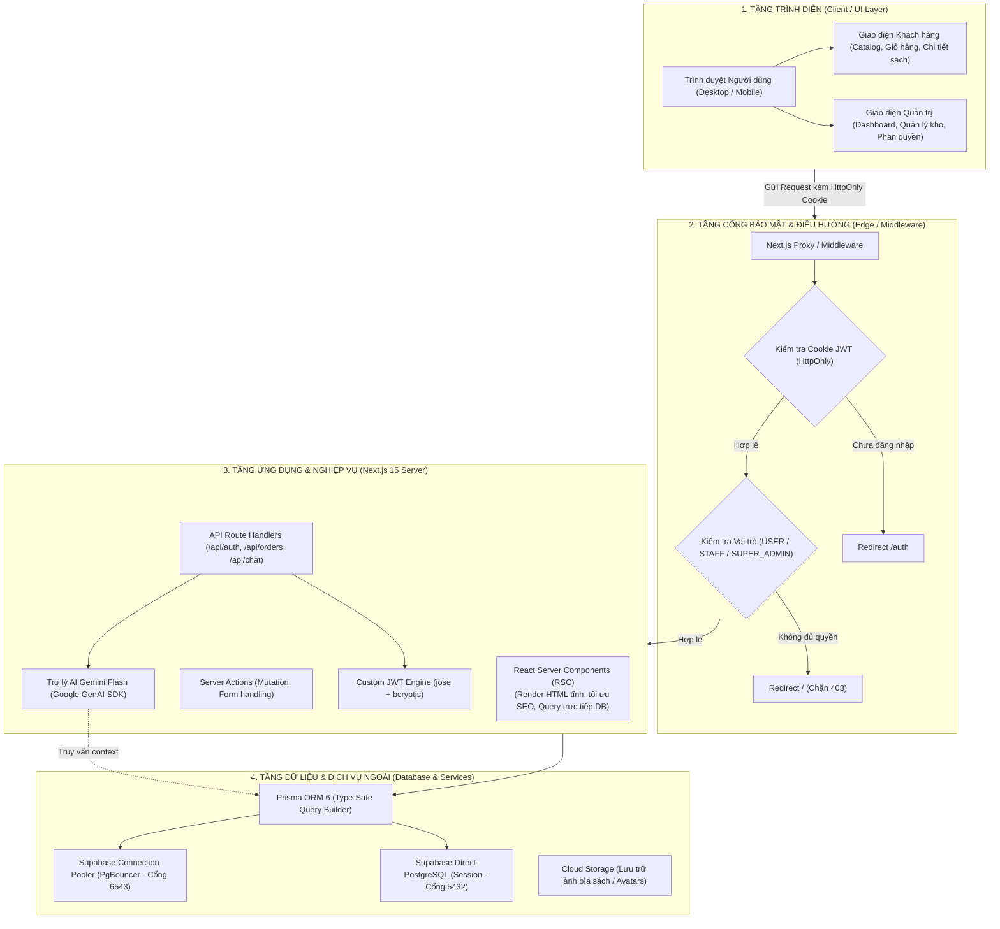

---

## 1.2 Sơ đồ Triển khai Vật lý (Deployment & Cloud Infrastructure)
Mô tả cơ sở hạ tầng thực tế khi hệ thống vận hành trên môi trường đám mây:

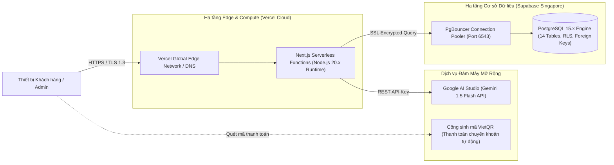

---

# PHẦN 2: Sơ Đồ Thiết Kế Cơ Sở Dữ Liệu (Database Design)

## 2.1 Sơ đồ Thực thể Quan hệ (Entity-Relationship Diagram - ERD)
Toàn bộ 14 bảng quan hệ được thiết kế chuẩn dạng chuẩn 3 (3NF), tuân thủ 100% `prisma/schema.prisma`:

```mermaid
erDiagram
    USER ||--o| USER_PROFILE : "has (1-1)"
    USER ||--o{ ORDER : "places (1-N)"
    USER ||--o{ REVIEW : "writes (1-N)"
    USER ||--o{ STAFF_PERMISSION : "holds (1-N)"
    USER ||--o{ STAFF_PERMISSION : "assigns (1-N)"
    USER ||--o{ AUDIT_LOG : "executes (1-N)"
    USER ||--o{ BEHAVIOR_EVENT : "triggers (1-N)"

    PERMISSION ||--o{ STAFF_PERMISSION : "granted_in (1-N)"

    CATEGORY ||--o{ CATEGORY : "parent_children (1-N)"
    CATEGORY ||--o{ BOOK_CATEGORY : "contains (1-N)"

    AUTHOR ||--o{ BOOK_AUTHOR : "writes (1-N)"

    BOOK ||--o{ BOOK_AUTHOR : "has_author (1-N)"
    BOOK ||--o{ BOOK_CATEGORY : "has_category (1-N)"
    BOOK ||--o{ ORDER_ITEM : "ordered_in (1-N)"
    BOOK ||--o{ REVIEW : "receives (1-N)"
    BOOK ||--o{ BEHAVIOR_EVENT : "viewed_in (1-N)"

    ORDER ||--o{ ORDER_ITEM : "contains (1-N)"

    USER {
        string id PK
        string email UK
        string password_hash
        string full_name
        string phone UK
        enum role "USER | STAFF | SUPER_ADMIN"
        enum status "ACTIVE | BANNED | UNVERIFIED"
        datetime created_at
    }

    USER_PROFILE {
        string id PK
        string user_id FK
        string address_province
        string address_district
        string address_ward
        string address_detail
        string[] preferred_genres
        string reading_level
    }

    PERMISSION {
        string id PK
        string code UK
        string name
        string description
    }

    STAFF_PERMISSION {
        string id PK
        string staff_id FK
        string permission_id FK
        string assigned_by_id FK
        datetime assigned_at
    }

    CATEGORY {
        string id PK
        string parent_id FK
        string name
        string slug UK
        int level "1: Ngành hàng, 2: Chuyên mục, 3: Chi tiết"
        int sort_order
    }

    AUTHOR {
        string id PK
        string name
        string slug UK
        string bio
    }

    BOOK {
        string id PK
        string isbn UK
        string title
        string slug UK
        int price
        int original_price
        int stock_qty
        int sold_count
        float avg_rating
        int rating_count
        boolean is_active
        boolean is_bestseller
        boolean is_new
    }

    BOOK_AUTHOR {
        string book_id PK,FK
        string author_id PK,FK
    }

    BOOK_CATEGORY {
        string book_id PK,FK
        string category_id PK,FK
    }

    ORDER {
        string id PK
        string order_code UK
        string user_id FK
        string customer_name
        string customer_phone
        string shipping_address
        int subtotal
        int shipping_fee
        int total_amount
        enum payment_method "COD | BANK_TRANSFER"
        enum payment_status "PENDING | PAID | FAILED | REFUNDED"
        enum status "PENDING | CONFIRMED | SHIPPING | DELIVERED | CANCELLED"
        datetime created_at
    }

    ORDER_ITEM {
        string id PK
        string order_id FK
        string book_id FK
        string book_title
        int unit_price
        int quantity
        int total_price
    }

    REVIEW {
        string id PK
        string book_id FK
        string user_id FK
        int rating "1 - 5 Sao"
        string body
        boolean is_verified_purchase
        enum status "PENDING | APPROVED | REJECTED"
        datetime created_at
    }

    AUDIT_LOG {
        string id PK
        string user_id FK
        string action
        string target_type
        string target_id
        json details
        datetime created_at
    }

    BEHAVIOR_EVENT {
        string id PK
        string user_id FK
        string session_id
        string event_type "view | add_to_cart | search | purchase"
        string book_id FK
        string search_query
        datetime created_at
    }
```

---

## 2.2 Từ điển Dữ liệu (Data Dictionary - 14 Tables)

| STT | Tên Bảng (Table Name) | Tên Model Prisma | Chức năng nghiệp vụ chính | Khóa chính / Khóa ngoại liên kết |
|:---:|---|---|---|---|
| 1 | `users` | `User` | Lưu trữ tài khoản người dùng, email, hash mật khẩu, phân quyền 3 vai trò (`USER`, `STAFF`, `SUPER_ADMIN`). | PK: `id` |
| 2 | `user_profiles` | `UserProfile` | Thông tin hồ sơ mở rộng, sổ địa chỉ nhận hàng, sở thích thể loại, cấp độ đọc sách. | PK: `id`, FK: `user_id` $\rightarrow$ `users(id)` |
| 3 | `permissions` | `Permission` | Danh mục mã quyền hệ thống (`MANAGE_BOOKS`, `MANAGE_ORDERS`, `MANAGE_USERS`,...). | PK: `id`, UK: `code` |
| 4 | `staff_permissions` | `StaffPermission` | Bảng phân quyền chi tiết cho từng nhân viên, ghi nhận ai là người cấp quyền (`assigned_by_id`). | PK: `id`, FK: `staff_id`, `permission_id`, `assigned_by_id` |
| 5 | `categories` | `Category` | Cây phân cấp thể loại 3 tầng (L1 Ngành hàng, L2 Chuyên mục, L3 Chi tiết) với quan hệ tự tham chiếu. | PK: `id`, FK: `parent_id` $\rightarrow$ `categories(id)` |
| 6 | `authors` | `Author` | Hồ sơ tác giả, tiểu sử, ảnh chân dung phục vụ tra cứu. | PK: `id`, UK: `slug` |
| 7 | `books` | `Book` | Thông tin đầu sách: giá bìa, giá bán, tồn kho, đã bán, thông số kỹ thuật, đánh giá trung bình. | PK: `id`, UK: `slug`, `isbn` |
| 8 | `book_authors` | `BookAuthor` | Bảng liên kết Nhiều-Nhiều (N-N) giữa Sách và Tác giả. | PK: (`book_id`, `author_id`) |
| 9 | `book_categories` | `BookCategory` | Bảng liên kết Nhiều-Nhiều (N-N) giữa Sách và Danh mục thể loại. | PK: (`book_id`, `category_id`) |
| 10 | `orders` | `Order` | Đơn hàng với mã định danh `TS-YYYYMMDD-XXXX`, địa chỉ, tiền hàng, phí ship, trạng thái đơn và thanh toán. | PK: `id`, UK: `order_code`, FK: `user_id` |
| 11 | `order_items` | `OrderItem` | Chi tiết từng cuốn sách trong đơn hàng, lưu snapshot giá và tên sách tại thời điểm mua. | PK: `id`, FK: `order_id`, `book_id` |
| 12 | `reviews` | `Review` | Đánh giá sao (1-5) và nhận xét của khách hàng, có cờ xác thực đã mua hàng và trạng thái duyệt. | PK: `id`, FK: `book_id`, `user_id` |
| 13 | `admin_audit_logs` | `AuditLog` | Nhật ký kiểm toán bảo mật: ghi nhận mọi thao tác thêm/sửa/xóa nhạy cảm của Admin và Staff. | PK: `id`, FK: `user_id` |
| 14 | `user_behavior_events` | `BehaviorEvent` | Thu thập nhật ký hành vi người dùng (xem sách, tìm kiếm, thêm giỏ) phục vụ thống kê & gợi ý AI. | PK: `id`, FK: `user_id`, `book_id` |

---

# PHẦN 3: Toàn Bộ Sơ Đồ Tiêu Chuẩn Cho Báo Cáo Đồ Án

## 3.1 Sơ đồ Ca Sử Dụng Tổng Quan (System Use Case Overview)

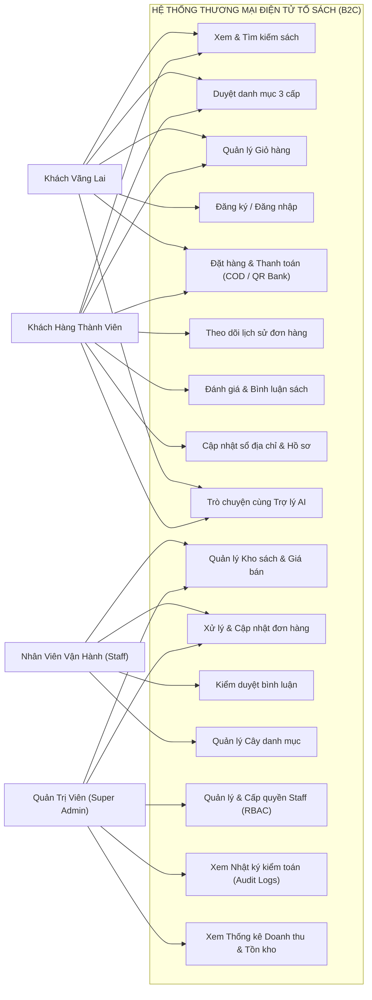

---

## 3.2 Phân Rã Use Case Theo Từng Phân Hệ

### A. Phân hệ Khách hàng (Customer Use Cases)
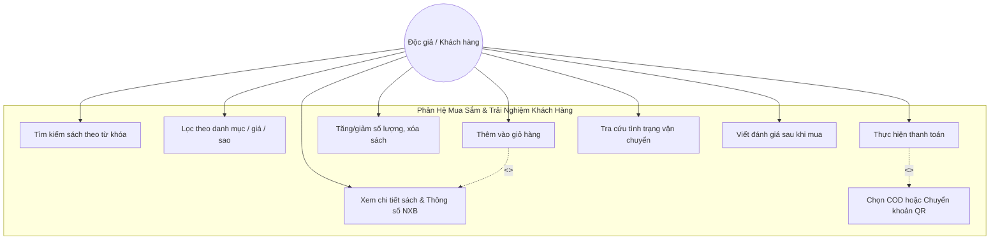

### B. Phân hệ Quản trị & Vận hành (Staff & Admin Use Cases)
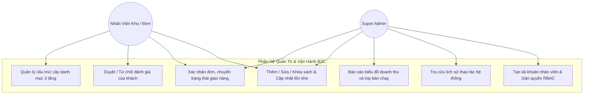

---

## 3.3 Sơ Đồ Hoạt Động Nghiệp Vụ (Activity Diagrams)

### Luồng 1: Quy trình Đặt hàng & Thanh toán Chuẩn TMĐT B2C (Checkout Flow)
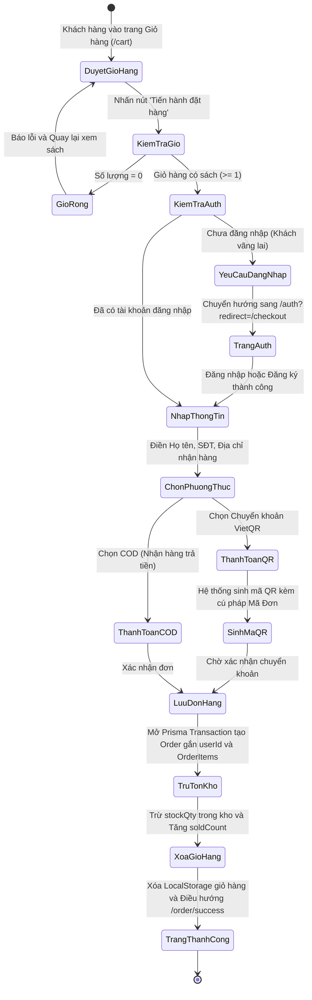

### Luồng 2: Quy trình Xác thực & Phân quyền RBAC (Middleware Gateway Flow)
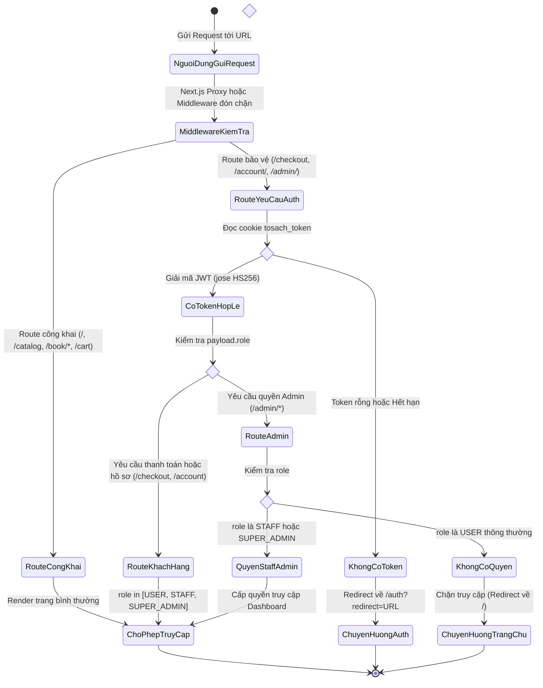

---

## 3.4 Sơ Đồ Tuần Tự Chi Tiết (Sequence Diagrams)

### Luồng 1: Đăng nhập Hệ thống & Thiết lập HttpOnly Cookie JWT
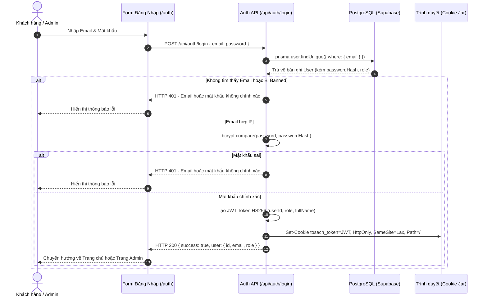

---

### Luồng 2: Khách hàng Đặt hàng & Xử lý Transaction Cơ Sở Dữ Liệu
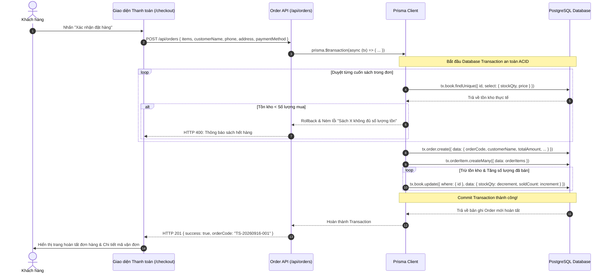

---

### Luồng 3: Trợ Lý AI Tư Vấn Sách (Gemini Flash RAG Flow)
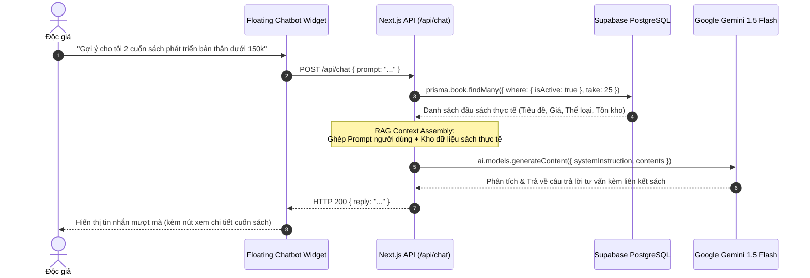

---

## 3.5 Sơ Đồ Chuyển Trạng Thái (State Machine Diagrams)

### A. Vòng đời Trạng thái Đơn hàng (`OrderStatus`)
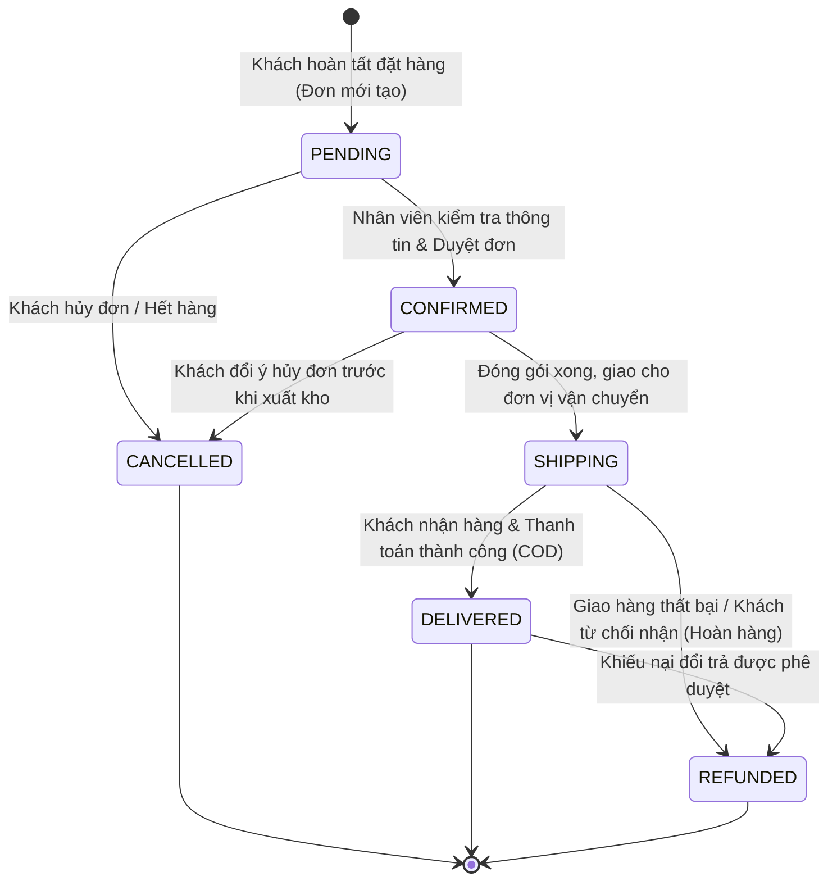

### B. Vòng đời Trạng thái Đánh giá Độc giả (`ReviewStatus`)
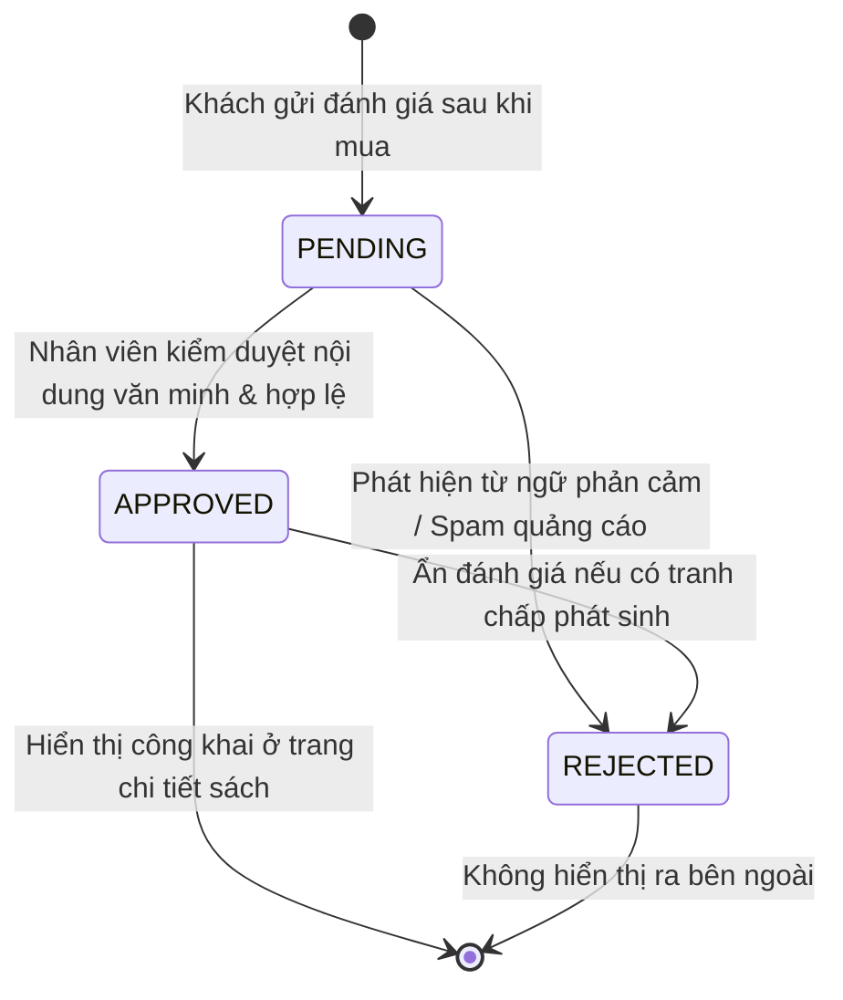

---

## 3.6 Sơ Đồ Cấu Trúc Thông Tin & Điều Hướng (Site Map / Information Architecture)

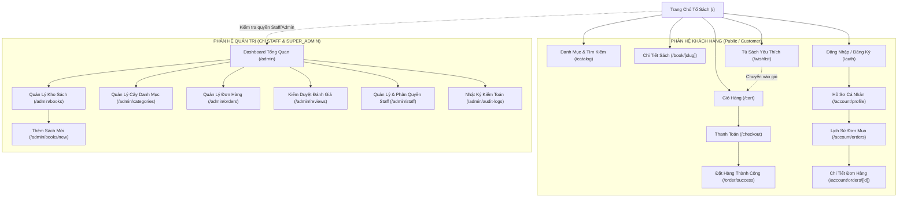

---

# PHẦN 4: Kế Hoạch Báo Cáo Tiến Độ 8 Tuần

> **Khung thời gian:** Từ **07/09/2026** đến **30/10/2026** (~8 tuần).  
> **Quy định báo cáo:** Báo cáo định kỳ **2 tuần một lần** (4 cột mốc lớn) kèm nhật ký công việc chi tiết từng tuần.

```
[TUẦN 1 - 2] =============> 🎯 BÁO CÁO ĐỢT 1 (20/09/2026): Nền tảng, Database & Auth [HOÀN THÀNH 100%]
[TUẦN 3 - 4] =============> 🎯 BÁO CÁO ĐỢT 2 (04/10/2026): Storefront Khách Hàng (Catalog, Cart, Checkout)
[TUẦN 5 - 6] =============> 🎯 BÁO CÁO ĐỢT 3 (18/10/2026): Phân Hệ Admin & Phân Quyền RBAC
[TUẦN 7 - 8] =============> 🎯 BÁO CÁO ĐỢT 4 (30/10/2026): Testing UAT, Deploy Production & Bảo Vệ
```

---

## 4.1 Lộ Trình 4 Chặng Báo Cáo (Milestones & Deliverables)

| Đợt Báo Cáo | Thời điểm | Tên Giai Đoạn | Mục tiêu cốt lõi cần đạt | Sản phẩm bàn giao (Deliverables) |
|:---:|:---:|---|---|---|
| **ĐỢT 1** | **20/09/2026**<br/>*(Cuối Tuần 2)* | **Khởi Tạo Nền Tảng, Thiết Kế UI & Kiến Trúc Dữ Liệu** | • Chốt mô hình B2C chuẩn Proposal.<br/>• Thống nhất toàn bộ thiết kế giao diện web (Design System, Wireframes & Mockups các trang chính).<br/>• Dựng Next.js 15, Prisma ORM 14 bảng, kết nối Supabase Cloud.<br/>• Xây dựng Custom JWT Auth & RBAC Middleware.<br/>• Nạp Seed Data mẫu và dựng Shared Layout (Header/Footer). | 1. Source code nhánh `main` trên GitHub.<br/>2. Database 14 bảng hoạt động trên Supabase.<br/>3. Bản quy chuẩn thiết kế UI/UX & Design System.<br/>4. Tài liệu thiết kế hệ thống (`DOCS_KIEN_TRUC_SO_DO_BAO_CAO.md`).<br/>5. Demo test thành công các API Auth. |
| **ĐỢT 2** | **04/10/2026**<br/>*(Cuối Tuần 4)* | **Trải Nghiệm Khách Hàng Toàn Diện (Storefront)** | • Hoàn thiện Trang chủ (Hero, Bestseller, Danh mục).<br/>• Hoàn thiện Trang Catalog bộ lọc 3 cấp & Tìm kiếm sách.<br/>• Trang Chi tiết sách & Form Đánh giá.<br/>• Hoàn thiện Giỏ hàng & Luồng Thanh toán (COD / Chuyển khoản QR) lưu đơn thật vào DB. | 1. Luồng mua hàng hoạt động từ A-Z trên web.<br/>2. Video demo quy trình đặt hàng và trừ tồn kho tự động.<br/>3. Đơn hàng hiển thị chuẩn trong bảng `orders` trên Supabase. |
| **ĐỢT 3** | **18/10/2026**<br/>*(Cuối Tuần 6)* | **Phân Hệ Quản Trị & Vận Hành (Admin & RBAC)** | • Xây dựng Dashboard thống kê doanh thu/tồn kho.<br/>• Module Quản lý kho sách (CRUD sách, upload ảnh bìa).<br/>• Module Quản lý danh mục 3 tầng & Xử lý đơn hàng.<br/>• Module Kiểm duyệt đánh giá & Phân quyền nhân viên động.<br/>• Nhật ký truy vết Audit Logs bảo mật. | 1. Toàn bộ route `/admin/*` hoạt động chuẩn với từng vai trò.<br/>2. Demo tài khoản Staff Kho không vào được trang Quản lý đơn, Staff Đơn không sửa được sách.<br/>3. Báo cáo kiểm thử bảo mật phân quyền. |
| **ĐỢT 4** | **30/10/2026**<br/>*(Nghiệm Thu)* | **Kiểm Thử Toàn Diện, Triển Khai & Hoàn Tất Đồ Án** | • Tích hợp Trợ lý AI Gemini Flash tư vấn sách.<br/>• Tối ưu Core Web Vitals, Responsive 100% Mobile/Tablet.<br/>• Triển khai Production lên Vercel Cloud (Live URL).<br/>• Hoàn tất Quyển Báo cáo Thuyết minh đồ án và Slide bảo vệ. | 1. Đường link trang web chính thức (Live Production URL).<br/>2. Quyển thuyết minh đồ án hoàn chỉnh (PDF/Word).<br/>3. Slide thuyết trình bảo vệ trước Hội đồng.<br/>4. Biên bản nghiệm thu sản phẩm phần mềm. |

---

## 4.2 Bảng Chi Tiết Công Việc Từng Tuần (Tuần 1 đến Tuần 8)

### Tuần 1: Khởi động dự án & Đặc tả kiến trúc (07/09 — 13/09/2026)
*Trạng thái: **ĐÃ HOÀN THÀNH 100%***
* **Mục tiêu:** Định vị mô hình B2C, loại bỏ các thành phần râu ria của prototype cũ, thiết kế ERD.
* **Đầu việc cụ thể:**
  - [x] Rà soát Proposal đồ án liên ngành, chốt mô hình B2C (bỏ bán sách cũ C2C, bỏ voucher, bỏ feed rao bán cá nhân).
  - [x] Lựa chọn Tech Stack: Next.js 15 (App Router), TypeScript, Tailwind CSS v4, Prisma ORM 6, PostgreSQL Supabase.
  - [x] Thiết kế sơ bộ bản vẽ ERD 14 bảng dữ liệu và sơ đồ Use Case tổng quan.
  - [x] Thiết lập Git repository cục bộ và remote GitHub an toàn.

### Tuần 2: Hiện thực hóa nền tảng, Database & Auth (14/09 — 20/09/2026)
*Trạng thái: **ĐÃ HOÀN THÀNH 100% (Đạt Mốc Báo Cáo 1)***
* **Mục tiêu:** Đưa Database lên Cloud, hoàn thành hệ thống Auth và dựng Shared Layout.
* **Đầu việc cụ thể:**
  - [x] Tạo dự án Next.js 15 tại thư mục gốc; lưu trữ code cũ vào [`legacy/`](file:///e:/to-sach-studio/legacy).
  - [x] Viết [`prisma/schema.prisma`](file:///e:/to-sach-studio/prisma/schema.prisma) 14 models; cấu hình Pooler và Direct URL.
  - [x] Đẩy bảng lên Supabase (`prisma db push`); viết và nạp `prisma/seed.ts` (4 users, 8 sách, 15 danh mục).
  - [x] Viết bộ xác thực Custom JWT (`src/lib/auth.ts`) và RBAC Proxy (`src/middleware.ts`).
  - [x] Dựng Header chuẩn Figma: Bố cục 3 cột, triệt tiêu Zero CLS, Top Bar marquee chạy từ trái sang phải, Mega Menu danh mục.
  - [x] Chuẩn hóa Typography: Font `Plus Jakarta Sans` hỗ trợ trọn vẹn dải ký tự và dấu tiếng Việt.
  - [x] Bộ nhận diện thương hiệu: Logo Tổ Sách từ `UI/logo - icon/Group.svg` và favicon tab trình duyệt `src/app/icon.svg`.
  - [x] Xây dựng CartContext với cơ chế Smart Cart Merge (cách ly user/guest, bảo mật đăng xuất).
  - [x] Dựng giao diện Trang chủ (`src/app/page.tsx`) kết nối Prisma query sách thật từ Supabase.
  - [x] Xây dựng Engine Tủ sách Yêu thích (`WishlistContext.tsx`) và trang `/wishlist`.
  - [x] Kết nối Catalog dữ liệu thật 100% từ Database Supabase, đếm đúng số sách theo thể loại/NXB.
  - [x] Kiểm thử biên dịch & Type Safety: `npx tsc --noEmit` đạt 0 lỗi, các trang render HTTP 200.
  - 🎯 **Nhiệm vụ báo cáo:** Đạt Mốc Báo Cáo 1 (Kiến trúc, Database, Auth và Brand Identity).

### Tuần 3: Danh Mục Sách & Trang Chi Tiết (21/09 — 27/09/2026)
*Trạng thái: **ĐANG THỰC HIỆN / TIẾP TỤC HOÀN THIỆN***
* **Mục tiêu:** Xây dựng xong trang duyệt sách theo danh mục và trang xem chi tiết sách.
* **Đầu việc cụ thể:**
  - [ ] Nâng cấp bộ lọc Catalog: Bộ lọc cây danh mục 3 tầng (L1 - L2 - L3), lọc khoảng giá, lọc NXB, lọc tình trạng kho.
  - [ ] Tìm kiếm sách toàn văn theo từ khóa hỗ trợ tiếng Việt không dấu.
  - [ ] Tích hợp tính năng sắp xếp: Giá tăng dần, Giá giảm dần, Mới nhất, Bán chạy nhất.
  - [ ] Xây dựng trang `/book/[slug]`: Render thông tin sách, thư viện ảnh bìa, thông số xuất bản (NXB, số trang, kích thước, định dạng).
  - [ ] Hiển thị danh sách đánh giá đã duyệt từ bảng `reviews` và tính toán sao trung bình.
  - [ ] Xử lý nút "Thêm vào giỏ hàng" và "Mua ngay" (chuyển tiếp tới `/cart` hoặc `/checkout`).

### Tuần 4: Giỏ Hàng & Quy Trình Thanh Toán Hoàn Chỉnh (28/09 — 04/10/2026)
* **Mục tiêu:** Khách hàng có thể đặt hàng thành công và hệ thống lưu đơn vào Database thật.
* **Đầu việc cụ thể:**
  - [ ] Xây dựng trang Giỏ hàng `/cart`: Tăng/giảm số lượng, kiểm tra giới hạn tồn kho, xóa sản phẩm, tính tổng tiền.
  - [ ] Xây dựng trang Thanh toán `/checkout`: Form nhập thông tin người nhận (Họ tên, SĐT, Tỉnh/Huyện/Xã/Địa chỉ chi tiết).
  - [ ] Xử lý 2 phương thức thanh toán: COD và Chuyển khoản QR ngân hàng (tự động điền mã đơn).
  - [ ] Viết API `/api/orders` dùng Prisma Transaction: tạo `orders`, tạo `order_items`, tự động trừ `stockQty` và tăng `soldCount`.
  - [ ] Xây dựng trang `/account/orders` hiển thị lịch sử đơn mua của người dùng kèm timeline trạng thái.
  - 🎯 **Nhiệm vụ báo cáo:** Nộp báo cáo Đợt 2 cho Giảng viên hướng dẫn (Toàn bộ luồng Khách hàng hoàn tất).

### Tuần 5: Phân Hệ Admin — Kho Sách & Danh Mục (05/10 — 11/10/2026)
* **Mục tiêu:** Xây dựng các chức năng quản lý danh mục và kho sách cho nhân viên kho.
* **Đầu việc cụ thể:**
  - [ ] Xây dựng layout trang Admin (`src/app/admin/layout.tsx`) với thanh điều hướng phân quyền.
  - [ ] Xây dựng Dashboard (`/admin`): Thẻ thống kê nhanh (Tổng doanh thu, Tổng đơn hàng, Tổng đầu sách, Đơn chờ xử lý).
  - [ ] Xây dựng Quản lý Kho sách (`/admin/books`): Bảng danh sách sách, tìm kiếm, lọc trạng thái kho (Còn hàng / Sắp hết / Hết hàng).
  - [ ] Xây dựng Form Thêm / Sửa sách (`/admin/books/new`, `/admin/books/[id]`): Nhập giá, tải ảnh bìa, chọn tác giả, chọn danh mục.
  - [ ] Xây dựng Quản lý Danh mục (`/admin/categories`): Thêm / sửa / xóa các cấp danh mục trong cây phân cấp.

### Tuần 6: Phân Hệ Admin — Đơn Hàng, Đánh Giá & Phân Quyền RBAC (12/10 — 18/10/2026)
* **Mục tiêu:** Hoàn thiện toàn bộ các chức năng quản trị còn lại của hệ thống.
* **Đầu việc cụ thể:**
  - [ ] Xây dựng Quản lý Đơn hàng (`/admin/orders`): Lọc theo trạng thái đơn (`PENDING`, `CONFIRMED`, `SHIPPING`, `DELIVERED`, `CANCELLED`).
  - [ ] Xây dựng chức năng cập nhật trạng thái đơn và mã vận đơn tracking code.
  - [ ] Xây dựng Kiểm duyệt Đánh giá (`/admin/reviews`): Duyệt (`APPROVED`) hoặc Từ chối (`REJECTED`) bình luận độc giả.
  - [ ] Xây dựng Phân quyền Nhân viên (`/admin/staff`): Chỉ `SUPER_ADMIN` mới được tạo tài khoản Staff và tích chọn cấp quyền.
  - [ ] Xây dựng Trang xem Nhật ký kiểm toán (`/admin/audit-logs`): Xem lại các thao tác nhạy cảm.
  - 🎯 **Nhiệm vụ báo cáo:** Nộp báo cáo Đợt 3 cho Giảng viên hướng dẫn (Phân hệ Admin & RBAC hoàn tất).

### Tuần 7: Tích Hợp Nâng Cao, Bảo Mật & Tối Ưu Hệ Thống (19/10 — 25/10/2026)
* **Mục tiêu:** Nâng cao chất lượng kỹ thuật, thêm tính năng AI và tối ưu hiệu năng.
* **Đầu việc cụ thể:**
  - [ ] Tích hợp Floating AI Chatbot (Gemini 1.5 Flash) qua API `/api/chat` đóng vai trò trợ lý tư vấn sách Tổ Sách.
  - [ ] Tối ưu hóa SEO: Thêm thẻ OpenGraph, Meta description, Schema markup `Product` và `BreadcrumbList` cho từng đầu sách.
  - [ ] Kiểm tra và gia cố bảo mật: Rate limiting chống spam API, validate dữ liệu đầu vào bằng `zod`.
  - [ ] Kiểm thử tự động: Viết kịch bản kiểm thử API (Auth, Order Creation) và kiểm tra tương thích trên màn hình điện thoại (Responsive Mobile).

### Tuần 8: Đóng Gói Triển Khai, Viết Báo Cáo & Chuẩn Bị Bảo Vệ (26/10 — 30/10/2026)
* **Mục tiêu:** Đưa hệ thống lên Production thực tế, hoàn tất hồ sơ nghiệm thu và slide bảo vệ.
* **Đầu việc cụ thể:**
  - [ ] Triển khai ứng dụng chính thức lên Vercel Cloud kết nối Supabase Cloud Production.
  - [ ] Kiểm tra toàn diện lần cuối trên đường link thật (UAT - User Acceptance Testing).
  - [ ] Soạn thảo và hoàn thiện Quyển Thuyết minh Báo cáo Đồ án (chèn toàn bộ sơ đồ ở Phần 1, 2, 3 vào báo cáo).
  - [ ] Thiết kế Slide thuyết trình bảo vệ đồ án (khoảng 20 - 25 slides tinh gọn, trực quan, làm nổi bật kiến trúc kỹ thuật).
  - [ ] Chuẩn bị kịch bản demo trực tiếp trước Hội đồng chấm thi.
  - 🎯 **Nhiệm vụ báo cáo:** Nghiệm thu toàn diện đề tài ngày 30/10/2026.

---

# PHẦN 5: Hướng Dẫn Trích Xuất Sơ Đồ Sang Word / PDF / LaTeX

Để đưa các sơ đồ trong tài liệu này vào file báo cáo Word (`.docx`), PDF hoặc LaTeX mà không bị vỡ nét hay nhòe chữ, bạn áp dụng 2 cách cực kỳ nhanh sau:

### Cách 1: Sử dụng Mermaid Live Editor (Khuyên dùng để lấy ảnh sắc nét nhất)
1. Truy cập trang web miễn phí: [mermaid.live](https://mermaid.live).
2. Sao chép đoạn mã của sơ đồ bạn cần (toàn bộ khối mã `mermaid`).
3. Dán vào khung soạn thảo bên trái.
4. Ở góc dưới bên phải màn hình preview, bấm nút **Actions** $\rightarrow$ Chọn **Download PNG (High Res)** hoặc **Download SVG** (Vector phóng to không bao giờ vỡ nét).
5. Chèn trực tiếp file ảnh tải về vào tài liệu Word báo cáo.

### Cách 2: Chụp trực tiếp từ VS Code / Antigravity IDE
1. Cài đặt tiện ích mở rộng **Markdown Preview Enhanced** trên VS Code.
2. Mở file tài liệu này và bấm `Ctrl + Shift + V` để mở bản xem trước.
3. Nhấp chuột phải vào bất kỳ sơ đồ nào $\rightarrow$ Chọn **Save as Image (PNG)**.
