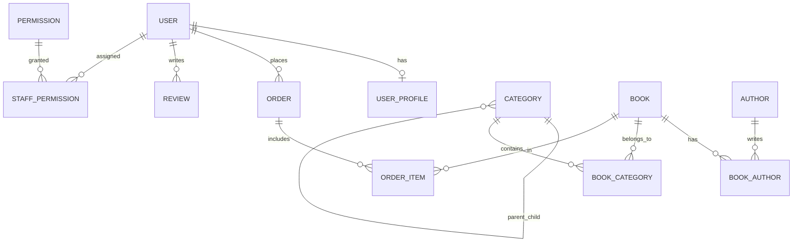

# TỔ SÁCH — TÀI LIỆU TOÀN DIỆN ĐỒ ÁN LIÊN NGÀNH
> **Khẩu hiệu:** *"Sách về tổ, tri thức bay xa"*  
> **Chuyên ngành:** Công nghệ Thông tin  
> **Thời gian bảo vệ dự kiến:** Tháng 10/2026  
> **Tác giả:** Hanh-Dang (hnhngyndng@gmail.com)

---

## 1. Tổng Quan Dự Án & Định Vị Mô Hình

### 1.1 Mục tiêu đề tài
Xây dựng một hệ sinh thái thương mại điện tử chuyên biệt cho ngành sách, giải quyết bài toán trải nghiệm mua sắm trực tuyến chuyên sâu, tinh gọn, tiện dụng cho độc giả và cung cấp công cụ vận hành trực quan, chuẩn chỉ cho nhà quản trị sách.

### 1.2 Mô hình kinh doanh: B2C Thuần Túy (Business-to-Consumer)
* **Bản chất:** Một đơn vị kinh doanh trung tâm (Tổ Sách) trực tiếp nhập, quản lý catalog và phân phối sách tới tay độc giả.
* **Lý do KHÔNG chọn Marketplace (C2C) hay Cho thuê sách:**
  1. **Đảm bảo chất lượng sách:** Khác với sàn C2C dễ gặp sách lậu, sách giả, mô hình B2C giúp nhà sách kiểm soát 100% bản quyền, nguồn gốc NXB chính thống.
  2. **Trải nghiệm khách hàng đồng nhất:** Quản lý tập trung từ khâu đóng gói, vận chuyển đến chăm sóc khách hàng.
  3. **Phù hợp với phạm vi đồ án:** Tập trung làm sâu và hoàn thiện trọn vẹn quy trình bán hàng, thanh toán, quản lý kho và phân quyền nhân viên thay vì dàn trải sang các module phức tạp của sàn đa người bán.

---

## 2. Kiến Trúc Kỹ Thuật (Tech Stack) & Cơ Sở Lựa Chọn

| Thành phần | Công nghệ | Lý do lựa chọn & Điểm mạnh bảo vệ đồ án |
|---|---|---|
| **Fullstack Framework** | **Next.js 15 (App Router)** | Hỗ trợ Server Components giúp tải trang cực nhanh, tối ưu SEO vượt trội cho sản phẩm sách, file-based routing trực quan, tích hợp sẵn API routes và Middleware. |
| **Ngôn ngữ** | **TypeScript** | Định kiểu tĩnh (Static Typing) chặt chẽ, bắt lỗi ngay trong quá trình biên dịch (Compile-time), mã nguồn dễ bảo trì và mở rộng. |
| **Styling** | **Tailwind CSS v4** | Hệ thống Utility-first CSS hiện đại, tối ưu dung lượng bundle, tái sử dụng Design System (`#0B1F3A` - Xanh hải quân, `#F5A623` - Vàng nghệ). |
| **Typography (Font chữ)** | **Plus Jakarta Sans** | Kiểu chữ hình học hiện đại, hỗ trợ chuẩn xác toàn bộ bộ ký tự và dấu tiếng Việt (Vietnam subsets), tối ưu tối đa cho ấn phẩm sách và văn bản dài. |
| **Nhận diện Thương hiệu** | **Logo Tổ Sách (`UI/logo - icon`)** | Biểu trưng độc quyền Tổ Sách: Tổ chim che chở, Đôi cánh tri thức và Hạt mầm tri thức tinh khôi trên nền khối bo tròn squircle `#0B1F3A`. |
| **ORM** | **Prisma 6** | Object-Relational Mapping kiểu an toàn (Type-safe), tự động sinh migration, hỗ trợ quan hệ bảng phức tạp, chống triệt để tấn công SQL Injection. |
| **Database** | **PostgreSQL (Supabase Cloud)** | Hệ quản trị cơ sở dữ liệu quan hệ mạnh mẽ, chuẩn ACID, hỗ trợ Transaction, Connection Pooling (PgBouncer) và Full-Text Search. |
| **Xác thực (Auth)** | **Custom JWT + HttpOnly Cookie + Bcrypt** | Cơ chế xác thực phi trạng thái (Stateless), bảo mật cao chống XSS (nhờ HttpOnly cookie) và CSRF (nhờ SameSite lax), mật khẩu được băm bằng thuật toán Bcrypt. |
| **Phân quyền (RBAC)** | **Next.js Proxy / Middleware** | Kiểm tra quyền truy cập route ngay tại tầng rìa mạng (Edge/Proxy), ngăn chặn truy cập trái phép vào trang Admin trước khi trang render. |

---

## 3. Thiết Kế Cơ Sở Dữ Liệu & Phân Quyền (RBAC)

Hệ thống gồm **14 bảng quan hệ** chặt chẽ trong file [`prisma/schema.prisma`](file:///e:/to-sach-studio/prisma/schema.prisma):



### 3.1 Mô hình Phân quyền Người dùng (RBAC)
Proposal quy định chuẩn **3 vai trò**:
1. **`USER` (Khách hàng):** Tìm kiếm sách, xem chi tiết, đánh giá, quản lý giỏ hàng, đặt hàng, theo dõi lịch sử đơn hàng, cập nhật sổ địa chỉ.
2. **`STAFF` (Nhân viên vận hành):** Phân quyền động qua bảng `staff_permissions`. Một nhân viên có thể được cấp 1 hoặc nhiều quyền:
   - `MANAGE_BOOKS`: Thêm/sửa/xóa sách, quản lý tồn kho và giá bìa.
   - `MANAGE_ORDERS`: Tiếp nhận, xác nhận đóng gói và cập nhật vận chuyển đơn hàng.
   - `MANAGE_CATEGORIES`: Quản lý cây phân cấp danh mục 3 tầng.
   - `MANAGE_REVIEWS`: Kiểm duyệt bình luận, đánh giá của khách hàng.
   - `VIEW_AUDIT_LOG`: Theo dõi nhật ký kiểm toán.
3. **`SUPER_ADMIN` (Quản trị viên tối cao):** Toàn quyền hệ thống, quản lý tài khoản nhân viên, cấp phát quyền hạn, xem doanh thu và thống kê.

### 3.2 Cơ Chế Quản Lý Giỏ Hàng Cách Ly & Hợp Nhất Thông Minh (Smart Cart Merge)
Hệ thống thương mại điện tử Tổ Sách áp dụng kiến trúc quản lý giỏ hàng theo chuẩn quốc tế (Shopee, Amazon), giải quyết triệt để bài toán bảo mật riêng tư và trải nghiệm người dùng liền mạch:
1. **Phân vùng giỏ hàng độc lập (Storage Partitioning):**
   - Khách vãng lai: Lưu vào key `tosach_guest_cart`.
   - Thành viên đã đăng nhập: Lưu vào key độc lập gắn chặt theo ID người dùng: `tosach_user_cart_<userId>`.
2. **Kịch bản 1 — Đăng ký tài khoản mới:**
   - Khách vãng lai nhặt sách vào giỏ $\rightarrow$ bấm Đặt hàng $\rightarrow$ sang `/auth` Đăng ký tài khoản mới.
   - Tài khoản mới tạo lập tức kế thừa 100% danh sách sách từ `tosach_guest_cart` sang `tosach_user_cart_<newUserId>`. Xóa sạch giỏ guest để giải phóng bộ nhớ.
3. **Kịch bản 2 — Đăng nhập tài khoản cũ (Smart Merge):**
   - Khách vãng lai nhặt sách mới bên ngoài $\rightarrow$ bấm Đăng nhập tài khoản đã có lịch sử giỏ hàng trước đó.
   - Hệ thống tự động **hợp nhất thông minh**: Nạp lịch sử giỏ hàng của tài khoản cũ, gộp thêm các cuốn sách vừa nhặt ngoài luồng (nếu trùng sách thì cộng dồn số lượng tối đa theo tồn kho `stockQty`, nếu sách mới thì thêm vào). Xóa sạch giỏ guest.
4. **Kịch bản 3 — Đăng xuất (Logout) & Bảo mật dữ liệu:**
   - Khi người dùng bấm Đăng xuất: Toàn bộ giỏ hàng của user được lưu lại an toàn vào `tosach_user_cart_<userId>`, giỏ hàng trên màn hình lập tức được reset về rỗng (`[]`).
   - Đảm bảo nếu người dùng khác đăng nhập vào cùng máy tính/trình duyệt, họ sẽ **hoàn toàn không bao giờ** nhìn thấy sản phẩm trong giỏ của người trước.

---

## 4. Nhật Ký Tiến Độ Dự Án (Project Progress)

```
[====== GIAI ĐOẠN 1: NỀN TẢNG (TUẦN 1) ======] ---> HOÀN THÀNH 100% (07/09 — 13/09/2026)
[=== GIAI ĐOẠN 2: FRONTEND & AUTH (TUẦN 2) ==] ---> HOÀN THÀNH 100% (14/09 — 20/09/2026) [MỐC BÁO CÁO 1]
[=== GIAI ĐOẠN 3: CATALOG & DETAILS (TUẦN 3) =] ---> ĐANG THỰC HIỆN (21/09 — 27/09/2026)
[   GIAI ĐOẠN 4: CART & CHECKOUT (TUẦN 4)    ] ---> DỰ KIẾN (28/09 — 04/10/2026) [MỐC BÁO CÁO 2]
[   GIAI ĐOẠN 5: ADMIN & RBAC (TUẦN 5-6)     ] ---> DỰ KIẾN (05/10 — 18/10/2026) [MỐC BÁO CÁO 3]
[   GIAI ĐOẠN 6: TEST, DEPLOY & BẢO VỆ (7-8) ] ---> DỰ KIẾN (19/10 — 30/10/2026) [MỐC BÁO CÁO 4]
```

### 4.1 Giai Đoạn 1 (Tuần 1: 07/09 — 13/09/2026): Nền Tảng Kiến Trúc & Thiết Kế Database
*Trạng thái: **ĐÃ HOÀN THÀNH 100%***

* [x] **Xác định định vị mô hình kinh doanh:** Lựa chọn mô hình B2C (Doanh nghiệp tới Khách hàng) thuần túy; giải trình lý do không chọn sàn thương mại C2C hay mô hình thuê sách.
* [x] **Phân tích yêu cầu & Use Cases:** Xây dựng sơ đồ Use Case cho 3 nhóm đối tượng: Khách hàng (`USER`), Nhân viên vận hành (`STAFF`), Quản trị viên tối cao (`SUPER_ADMIN`).
* [x] **Thiết kế Cơ sở Dữ liệu quan hệ (ERD):** Thiết kế hoàn chỉnh 14 bảng quan hệ với ràng buộc toàn vẹn, khoá ngoại, Index và Enum trạng thái (`Role`, `OrderStatus`, `PaymentStatus`, `PaymentMethod`, `BookFormat`).
* [x] **Thiết kế phân quyền động (Dynamic RBAC):** Xây dựng bảng `permissions` và `staff_permissions` cho phép cấp quyền chi tiết từng chức năng cho nhân viên.
* [x] **Dọn dẹp mã nguồn cũ:** Chuyển đổi toàn bộ code prototype Express/Vite cũ vào thư mục `legacy/` làm tư liệu tham khảo UI/Logic.

---

### 4.2 Giai Đoạn 2 (Tuần 2: 14/09 — 20/09/2026): Frontend, Auth & Chuẩn Hóa Thương Hiệu
*Trạng thái: **ĐÃ HOÀN THÀNH 100% (Đạt Mốc Báo Cáo 1)***

* [x] **Dọn dẹp kiến trúc:** Chuyển toàn bộ code Express/Vite prototype vào `legacy/` làm tư liệu tham khảo UI/Logic.
* [x] **Khởi tạo Framework chuẩn:** Thiết lập dự án Next.js 15 (App Router, TypeScript, Tailwind CSS v4) tại thư mục gốc.
* [x] **Thiết kế Database chuẩn Proposal:** Xây dựng `prisma/schema.prisma` với đầy đủ 14 bảng quan hệ, Enum phân quyền 3 vai trò (`USER`, `STAFF`, `SUPER_ADMIN`).
* [x] **Kết nối & Đẩy bảng lên Supabase Cloud:** Chạy `npx prisma db push` thành công 100% lên PostgreSQL Supabase Singapore.
* [x] **Nạp dữ liệu mẫu ban đầu (Seed Data):** Viết và chạy `prisma/seed.ts` nạp thành công 6 quyền hạn, 4 tài khoản mẫu (`admin@tosach.vn`, `staff.kho@tosach.vn`, `staff.order@tosach.vn`, `customer@gmail.com`), 8 đầu sách, cây danh mục 3 tầng, tác giả và đơn hàng mẫu.
* [x] **Hệ thống Xác thực (Auth Engine):** Viết `src/lib/auth.ts`, các API route `/api/auth/login`, `/api/auth/register`, `/api/auth/logout`, `/api/auth/me` với JWT mã hóa `jose` và HttpOnly Cookie.
* [x] **Khung Layout & Header Chuẩn Thương Hiệu Figma (`src/components/layout/CustomerHeader.tsx`):**
  - Căn chỉnh bố cục chuẩn: Cột trái (Logo thương hiệu Tổ Sách), Cột giữa (Trang chủ, Danh mục Mega Menu, Tất cả sách), Cột phải (Tìm kiếm nhanh, Yêu thích, Giỏ hàng, Khung tài khoản).
  - Triệt tiêu hoàn toàn xô lệch layout (Zero Cumulative Layout Shift - CLS) khi đăng nhập / đăng xuất bằng cách cố định khung tài khoản `w-[125px] sm:w-[145px]`.
  - Thanh thông báo Top Bar chạy liên tục từ TRÁI SANG PHẢI (Left-to-Right marquee) tốc độ 55s mượt mà, loại bỏ triệt để voucher giảm giá để tuân thủ 100% mô hình B2C chiết khấu trực tiếp trên giá bìa.
  - Tích hợp Mega Menu xổ xuống xem nhanh 4 ngành hàng với đường dẫn trực tiếp sang trang Catalog.
* [x] **Typography Chuẩn Mực Xuất Bản — Plus Jakarta Sans:**
  - Thay thế font Geist và Arial fallback bằng `Plus Jakarta Sans` hỗ trợ trọn vẹn dải ký tự và thanh dấu tiếng Việt (`subsets: ['vietnamese', 'latin']`, `weights: 400-800`).
  - Cấu hình đồng bộ trong `src/app/layout.tsx`, `src/app/globals.css`, cập nhật `README.md` và tài liệu kiến trúc.
* [x] **Bộ Nhận Diện Thương Hiệu & Logo Chính Thức:**
  - Sử dụng vector chuẩn từ `UI/logo - icon/Group.svg` tạo component `ToSachLogo.tsx` (Tổ chim che chở, Đôi cánh tri thức và Hạt mầm tri thức trên squircle `#0B1F3A`).
  - Thay thế toàn bộ icon `BookOpen` cũ tại CustomerHeader, CustomerFooter, trang Auth, và xuất file `src/app/icon.svg` làm favicon tab trình duyệt.
* [x] **Làm Sạch Dữ Liệu Catalog — 100% Kết Nối Database Thật (`src/app/catalog`):**
  - Xóa bỏ hoàn toàn dữ liệu giả (Mock Books).
  - Kết nối trực tiếp Prisma ORM truy vấn đúng 8 tựa sách, hiển thị số lượng chính xác trong ngoặc đơn theo từng thể loại (Văn học: 3, Công nghệ: 2, Kinh tế: 1, Lịch sử: 1, Tâm lý: 1) và các Nhà xuất bản thật (NXB Trẻ, NXB Hội Nhà Văn, NXB Lao Động, NXB Tri Thức...).
* [x] **Hệ Thống Tủ Sách Yêu Thích Toàn Diện (Wishlist Engine):**
  - Xây dựng `WishlistContext.tsx`: Quản lý danh sách sách yêu thích, lưu trữ cục bộ `localStorage` phân vùng độc lập giữa khách vãng lai (`tosach_guest_wishlist`) và tài khoản đăng nhập (`tosach_user_wishlist_${userId}`).
  - Tự động hợp nhất (Smart Merge) khi đăng nhập: gộp các đầu sách khách vãng lai đã thích vào tài khoản đăng nhập mà không trùng lặp.
  - Tích hợp nút Trái tim tương tác realtime trên cả 2 component thẻ sách: `BookCard.tsx` (Trang chủ) và `CatalogBookCard.tsx` (Trang Catalog).
  - Huy hiệu số lượng sách yêu thích trên CustomerHeader (Desktop & Mobile Drawer) cập nhật tức thì.
  - Xây dựng Trang quản lý Sách Yêu Thích chuyên biệt tại `src/app/wishlist/page.tsx`: Cho phép xem danh sách, xóa từng cuốn, xóa tất cả, hoặc 1-Click "Chuyển Tất Cả Vào Giỏ Hàng", kèm giao diện Empty State thân thiện.
* [x] **Kiểm thử biên dịch & Type Safety:** Kiểm tra `npx tsc --noEmit` đạt 0 lỗi; kiểm tra các trang `/`, `/catalog`, `/wishlist`, `/auth` đều render HTTP 200 thành công.

---

### 4.3 Giai Đoạn 3 (Tuần 3: 21/09 — 27/09/2026): Bộ Lọc Catalog Đa Chiều & Trang Chi Tiết Sách
*Trạng thái: **ĐANG THỰC HIỆN / TIẾP TỤC HOÀN THIỆN***

* **Hiện trạng tiến độ Tuần 3:**
  - Đã kết nối dữ liệu thật từ Supabase DB cho trang Catalog và Tủ sách yêu thích (Wishlist).
  - Toàn bộ mã nguồn đang được giữ an toàn trên local theo đúng chỉ đạo tiến độ, chưa commit vội để chờ hoàn thiện đồng bộ.
* **Các hạng mục đang và sẽ làm tiếp trong Tuần 3:**
  * [ ] **Bước 1 — Nâng cấp Bộ Lọc & Tìm Kiếm Catalog (`src/app/catalog/page.tsx`):**
    - [ ] Lọc sách theo Danh mục 3 cấp (L1 - L2 - L3) lấy từ Supabase DB.
    - [ ] Lọc theo khoảng giá bìa và mức đánh giá sao.
    - [ ] Sắp xếp: Bán chạy nhất (`soldCount`), Giá tăng dần, Giá giảm dần, Mới nhất.
    - [ ] Tìm kiếm sách toàn văn theo từ khóa (tiêu đề, tác giả, mô tả) hỗ trợ tiếng Việt không dấu.
  * [ ] **Bước 2 — Xây dựng Trang Chi Tiết Sách (`src/app/book/[slug]/page.tsx`):**
    - [ ] Dynamic Route hiển thị chi tiết sách theo slug chuẩn SEO.
    - [ ] Thư viện ảnh bìa sách, thông số xuất bản (NXB, số trang, kích thước, định dạng bìa).
    - [ ] Hiển thị danh sách đánh giá đã duyệt từ bảng `reviews`.
    - [ ] Xử lý nút "Thêm vào giỏ" và "Mua ngay" (chuyển tiếp tới `/cart` hoặc `/checkout`).

---

### 4.4 Lộ Trình Các Tuần Tiếp Theo (Kế Hoạch Đến Khi Bảo Vệ Đồ Án)

* **Tuần 4 (28/09 — 04/10/2026) [Mốc Báo Cáo 2]:**
  - Trang Giỏ hàng hoàn chỉnh (`/cart`): Tăng giảm số lượng, tính phí vận chuyển theo chính sách Freeship $\ge$ 150k.
  - Trang Đặt hàng & Thanh toán (`/checkout`): Sổ địa chỉ giao hàng, phương thức thanh toán COD & Chuyển khoản VietQR tự động sinh mã thanh toán, Database Transaction tạo `Order` và `OrderItem` trong Supabase.
* **Tuần 5 (05/10 — 11/10/2026):**
  - Phân hệ Quản trị (Admin Panel): Dashboard tổng quan doanh thu, biểu đồ tăng trưởng đơn hàng, module Quản lý kho sách (CRUD sách, cập nhật tồn kho, nhập hàng) và Quản lý danh mục.
* **Tuần 6 (12/10 — 18/10/2026) [Mốc Báo Cáo 3]:**
  - Phân hệ Admin: Quản lý và duyệt trạng thái đơn hàng (Chờ xác nhận $\rightarrow$ Đang đóng gói $\rightarrow$ Đang giao $\rightarrow$ Đã giao $\rightarrow$ Hủy đơn), Kiểm duyệt đánh giá sách, Quản trị phân quyền động RBAC cho nhân viên kho và nhân viên đơn hàng.
* **Tuần 7 (19/10 — 25/10/2026):**
  - Tích hợp Trợ lý AI tư vấn sách thông minh (Google Gemini API), tối ưu hóa SEO On-page toàn trang, Audit bảo mật và kiểm thử hiệu năng/giao diện đa thiết bị (Mobile/Tablet/Desktop).
* **Tuần 8 (26/10 — 30/10/2026) [Mốc Báo Cáo 4 - Nghiệm Thu Đồ Án]:**
  - Triển khai Production lên Vercel Cloud kết nối Supabase PostgreSQL thật, nghiệm thu UAT, hoàn thiện Quyển Báo cáo Thuyết minh A4 chuẩn định dạng khoa học và Slide thuyết trình bảo vệ đồ án.

---

## 5. Bí Kíp Trả Lời Câu Hỏi Hội Đồng Bảo Vệ (Q&A Defense Cheat Sheet)

### Câu 1: Tại sao em chuyển từ mô hình Express + Vite SPA sang Next.js App Router?
> **Trả lời:**  
> *"Dự án sách là một website thương mại điện tử phụ thuộc rất nhiều vào SEO và tốc độ tải trang lần đầu (First Contentful Paint). Vite SPA tải toàn bộ bundle JavaScript về trình duyệt rồi mới render (CSR), dẫn đến bot tìm kiếm (Google) khó lập chỉ mục chi tiết từng cuốn sách và người dùng bị màn hình trắng khi tải mạng chậm.  
> Em chọn Next.js App Router vì tính năng Server Components: toàn bộ dữ liệu sách được truy vấn trực tiếp từ PostgreSQL và render thành HTML tĩnh ngay trên server, tối ưu SEO 100%, bảo mật kết nối Database tuyệt đối và giảm dung lượng tải về máy khách."*

### Câu 2: Cơ chế xác thực (Authentication) của hệ thống hoạt động ra sao?
> **Trả lời:**  
> *"Hệ thống sử dụng Custom JWT kết hợp với HttpOnly Cookie. Khi người dùng đăng nhập, backend kiểm tra mật khẩu bằng thuật toán băm Bcrypt. Nếu đúng, server tạo một mã JSON Web Token (JWT) được ký số bảo mật bằng thư viện `jose` (thuật toán HS256), chứa thông tin định danh và vai trò của user, sau đó gán vào Cookie với cờ `HttpOnly` và `SameSite=Lax`.  
> Cách này vượt trội hơn lưu JWT trong LocalStorage vì ngăn chặn hoàn toàn nguy cơ bị hacker đánh cắp token qua các cuộc tấn công XSS (Cross-Site Scripting)."*

### Câu 3: Làm thế nào để phân quyền nhân viên (RBAC) mà không bị lộ quyền?
> **Trả lời:**  
> *"Hệ thống sử dụng bảo vệ 2 lớp:  
> 1. Lớp ngoài: Next.js Proxy/Middleware giải mã token ngay khi request tới server, lập tức chặn và chuyển hướng nếu vai trò không phải `STAFF` hoặc `SUPER_ADMIN`.  
> 2. Lớp trong: Tại Database, em thiết kế bảng `permissions` và bảng quan hệ `staff_permissions`. Mỗi khi nhân viên thực hiện một tác vụ quản trị (như xóa sách hoặc sửa đơn), server kiểm tra chính xác quyền trong cơ sở dữ liệu trước khi thực thi truy vấn."*

---

## 6. Quy Chuẩn Xây Dựng Giao Diện (UI Implementation Rules)

Để đảm bảo dự án bám sát 100% Proposal B2C và không bị nhầm lẫn giữa mã nguồn thương mại thật với các công cụ kiểm thử, toàn bộ quá trình migrate từ `UI/` và `legacy/` phải tuân thủ nghiêm ngặt bảng phân định sau:

### 6.1 Các thành phần BỎ HOÀN TOÀN (Không code, không tạo route):
* ❌ **Thẻ Banner Kêu gọi Seller / Trở thành người bán:** Mang bản chất marketplace C2C.
* ❌ **Vừa Đăng Bán (Realtime Feed):** Tính năng người dùng cá nhân bán lại sách cũ.
* ❌ **Request Rare Book Banner:** Tính năng tìm sách hiếm từ cộng đồng C2C.
* ❌ **Ô nhập Voucher / Quản lý Voucher:** Proposal B2C tập trung bán trực tiếp, đã lược bỏ hệ thống voucher phức tạp.
* ❌ **Floating AI Chatbot:** Tránh phân tán phạm vi chức năng bắt buộc của đồ án.

### 6.2 Giao diện Thực Tế của Hệ Thống (Production UI):
Toàn bộ mã nguồn sẽ bám sát thiết kế trong `UI/` và tái sử dụng JSX/Tailwind đã dựng sẵn trong `legacy/src/`:
1. **Header & Navigation B2C:** Logo thương hiệu Tổ Sách, ô tìm kiếm sách trực quan, nút Giỏ hàng kèm số lượng badge, Menu Tài khoản (Đăng nhập / Hồ sơ / Đơn mua).
2. **Trang Chủ (`/`):** Hero Banner giới thiệu Tổ Sách, Thống kê nhanh (Micro Stats), Sách Nổi Bật (dựa trên top bán chạy từ DB), Giờ Vàng Giá Tốt (Flash Sale), Mới Lên Kệ, Cây thể loại chính, Footer thương hiệu B2C.
3. **Trang Danh Mục & Tìm Kiếm (`/catalog`):** Bộ lọc danh mục 3 cấp (L1 - L2 - L3), lọc khoảng giá, lọc đánh giá sao, sắp xếp (Bán chạy, Giá tăng/giảm), phân trang hoặc infinite scroll.
4. **Trang Chi Tiết Sách (`/book/[slug]`):** Thư viện ảnh bìa, thông tin xuất bản, tình trạng kho, mô tả nội dung, đánh giá đã kiểm duyệt từ độc giả, nút Mua ngay / Thêm vào giỏ.
5. **Giỏ Hàng & Thanh Toán (`/cart`, `/checkout`):** Xem danh sách sách đã chọn, cập nhật số lượng, form thông tin giao hàng, chọn phương thức COD hoặc Chuyển khoản QR ngân hàng, lưu đơn thật vào DB.
6. **Lịch Sử Đơn Hàng & Hồ Sơ (`/orders`, `/profile`):** Danh sách đơn mua, trạng thái vận chuyển theo timeline, cập nhật địa chỉ giao hàng.
7. **Khu Vực Quản Trị Admin (`/admin`):** Dashboard thống kê doanh thu, Quản lý kho sách (Thêm/Sửa/Xóa/Tồn kho), Quản lý cây danh mục 3 cấp, Xử lý đơn hàng, Phân quyền nhân viên (RBAC), Nhật ký kiểm toán (Audit Logs).

### 6.3 Giao diện Phục Vụ Quá Trình Dev & Kiểm Thử (Testing-Only UI):
Các thành phần này chỉ được phép tồn tại tạm thời trong lúc code và demo kiểm thử, **phải cô lập và gỡ bỏ / tắt khi đóng gói nghiệm thu đồ án**:
* ⚠️ **Dev Role Quick Switcher (Thanh chuyển đổi vai trò nhanh):** Nút bấm hoặc thanh công cụ nổi giúp lập trình viên switch nhanh giữa tài khoản `Khách hàng` $\leftrightarrow$ `Staff Kho` $\leftrightarrow$ `Staff Đơn` $\leftrightarrow$ `Super Admin` mà không phải gõ email/password nhiều lần.
  - *Quy tắc:* Phải được bọc trong điều kiện kiểm tra môi trường:
    ```tsx
    if (process.env.NODE_ENV !== 'production') {
      // Chỉ hiển thị trên localhost trong quá trình dev
    }
    ```
  - *Khi chốt đồ án:* Xóa component này ra khỏi cây giao diện chính để khách hàng chỉ đăng nhập qua trang `/auth` thực tế.
* ⚠️ **Debug Inspector / Dev Badges:** Các badge hiển thị thời gian phản hồi query DB hoặc payload token trên giao diện test.
