# 📐 THIẾT KẾ KIẾN TRÚC HỆ THỐNG, CƠ SỞ DỮ LIỆU & KẾ HOẠCH BÁO CÁO ĐỒ ÁN
> **Đề tài:** Hệ thống Thương mại Điện tử Bán Sách Trực tuyến **Tổ Sách** (B2C)  
> **Khẩu hiệu:** *"Sách về tổ, tri thức bay xa"*  
> **Chuyên ngành:** Công nghệ Thông tin (Đồ án tốt nghiệp / Đồ án liên ngành)  
> **Tác giả:** Hanh-Dang (hnhngyndng@gmail.com)  
> **Thời gian thực hiện:** 07/09/2026 — 30/10/2026 (8 tuần)

---

> [!IMPORTANT]
> **Tài liệu này được biên soạn theo chuẩn học thuật chuyên ngành CNTT / Kỹ thuật Phần mềm.**  
> Bạn có thể trích xuất trực tiếp các sơ đồ (sử dụng [mermaid.live](https://mermaid.live) hoặc copy mã nguồn) để đưa vào **Quyển Báo cáo Thuyết minh Đồ án** và **Slide Thuyết trình Bảo vệ** trước Hội đồng chấm thi.

---

## 📑 MỤC LỤC
1. [PHẦN 1: Sơ Đồ Kiến Trúc Hệ Thống (System Architecture)](#-phần-1-sơ-đồ-kiến-trúc-hệ-thống)
   - [1.1 Sơ đồ Kiến trúc Phân tầng (N-Tier Architecture)](#11-sơ-đồ-kiến-trúc-phân-tầng-n-tier-architecture)
   - [1.2 Sơ đồ Triển khai Vật lý (Deployment & Cloud Infrastructure)](#12-sơ-đồ-triển-khai-vật-lý-deployment--cloud-infrastructure)
2. [PHẦN 2: Sơ Đồ Thiết Kế Cơ Sở Dữ Liệu (Database Design)](#-phần-2-sơ-đồ-thiết-kế-cơ-sở-dữ-liệu)
   - [2.1 Sơ đồ Thực thể Quan hệ (ERD - 14 Bảng Chuẩn 3NF)](#21-sơ-đồ-thực-thể-quan-hệ-erd---14-bảng-chuẩn-3nf)
   - [2.2 Từ điển Dữ liệu Chi tiết (Data Dictionary)](#22-từ-điển-dữ-liệu-chi-tiết-data-dictionary)
3. [PHẦN 3: Toàn Bộ Sơ Đồ Tiêu Chuẩn Cho Báo Cáo Đồ Án (UML 2.5)](#-phần-3-toàn-bộ-sơ-đồ-tiêu-chuẩn-cho-báo-cáo-đồ-án)
   - [3.1 Sơ đồ Ca Sử Dụng Tổng quan (System Use Case)](#31-sơ-đồ-ca-sử-dụng-tổng-quan-system-use-case)
   - [3.2 Phân rã Use Case theo Nhóm Người dùng](#32-phân-rã-use-case-theo-nhóm-người-dùng)
   - [3.3 Sơ đồ Hoạt động Nghiệp vụ (Activity Diagrams)](#33-sơ-đồ-hoạt-động-nghiệp-vụ-activity-diagrams)
   - [3.4 Sơ đồ Tuần tự Chi tiết (Sequence Diagrams)](#34-sơ-đồ-tuần-tự-chi-tiết-sequence-diagrams)
   - [3.5 Sơ đồ Chuyển Trạng thái (State Machine Diagrams)](#35-sơ-đồ-chuyển-trạng-thái-state-machine-diagrams)
   - [3.6 Sơ đồ Cấu trúc Thông tin & Điều hướng (Site Map / Information Architecture)](#36-sơ-đồ-cấu-trúc-thông-tin--điều-hướng-site-map)
4. [PHẦN 4: Kế Hoạch Báo Cáo Tiến Độ 8 Tuần (07/09 — 30/10/2026)](#-phần-4-kế-hoạch-báo-cáo-tiến-độ-8-tuần)
   - [4.1 Bảng 4 Cột Mốc Báo Cáo Chính (Milestones & Deliverables)](#41-bảng-4-cột-mốc-báo-cáo-chính)
   - [4.2 Bảng Chi tiết Công việc Từng Tuần (Tuần 1 đến Tuần 8)](#42-bảng-chi-tiết-công-việc-từng-tuần)
5. [PHẦN 5: Hướng Dẫn Trích Xuất Sơ Đồ Sang Word / Slide Chất Lượng Cao](#-phần-5-hướng-dẫn-trích-xuất-sơ-đồ)

---

# 🏛️ PHẦN 1: Sơ Đồ Kiến Trúc Hệ Thống

## 1.1 Sơ đồ Kiến trúc Phân tầng (N-Tier Architecture)

> [!NOTE]
> Hệ thống áp dụng mô hình **Modern Fullstack Serverless Architecture** với **Next.js 15 App Router** làm hạt nhân, tách biệt 4 phân tầng độc lập giúp dễ bảo trì, tăng tính bảo mật và đạt điểm tối đa khi bảo vệ trước Hội đồng.

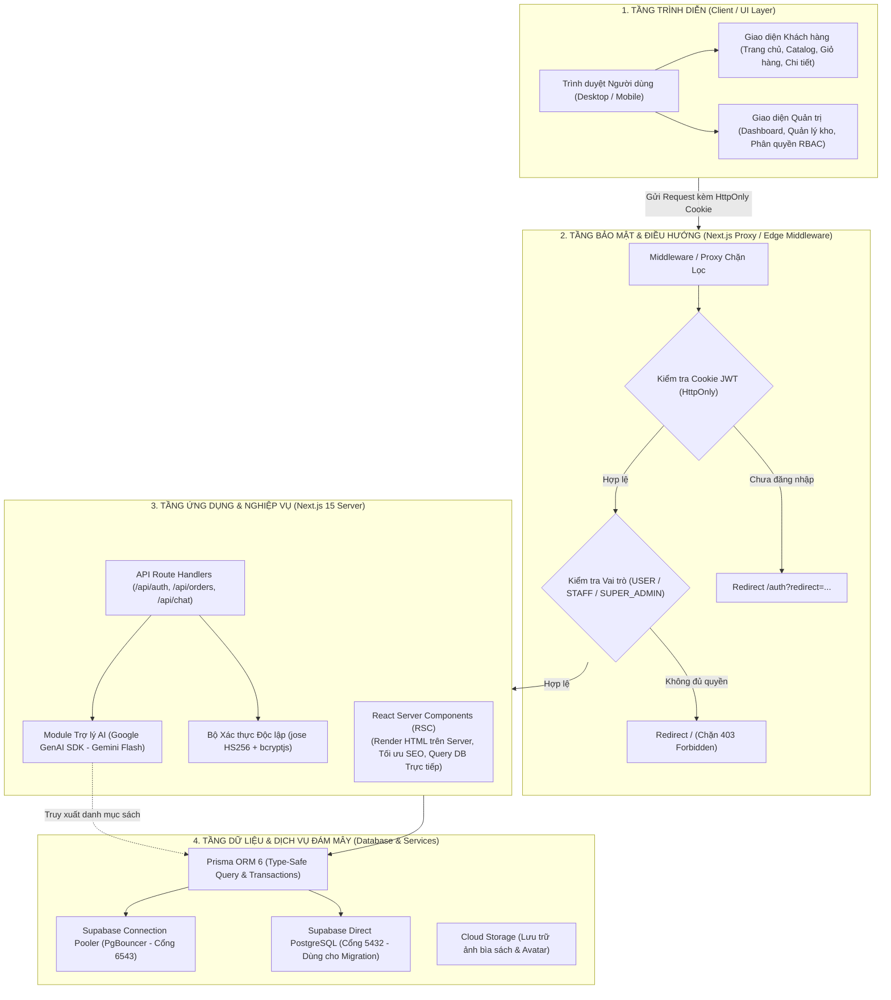

---

## 1.2 Sơ đồ Triển khai Vật lý (Deployment & Cloud Infrastructure)

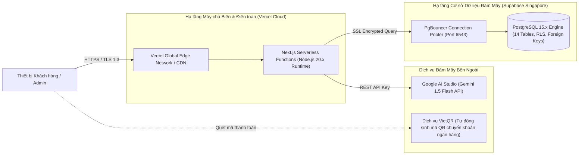

---

# 🗄️ PHẦN 2: Sơ Đồ Thiết Kế Cơ Sở Dữ Liệu

## 2.1 Sơ đồ Thực thể Quan hệ (ERD - 14 Bảng Chuẩn 3NF)

> [!TIP]
> Toàn bộ 14 thực thể được đồng bộ 100% với file [`prisma/schema.prisma`](file:///e:/to-sach-studio/prisma/schema.prisma) đang chạy trực tiếp trên Supabase PostgreSQL.

```mermaid
erDiagram
    USER ||--o| USER_PROFILE : "has (1-1)"
    USER ||--o{ ORDER : "places (1-N)"
    USER ||--o{ REVIEW : "writes (1-N)"
    USER ||--o{ STAFF_PERMISSION : "holds (1-N)"
    USER ||--o{ STAFF_PERMISSION : "assigns (1-N)"
    USER ||--o{ AUDIT_LOG : "executes (1-N)"
    USER ||--o{ BEHAVIOR_EVENT : "triggers (1-N)"

    PERMISSION ||--o{ STAFF_PERMISSION : "granted_in (1-N)"

    CATEGORY ||--o{ CATEGORY : "parent_children (1-N)"
    CATEGORY ||--o{ BOOK_CATEGORY : "contains (1-N)"

    AUTHOR ||--o{ BOOK_AUTHOR : "writes (1-N)"

    BOOK ||--o{ BOOK_AUTHOR : "has_author (1-N)"
    BOOK ||--o{ BOOK_CATEGORY : "has_category (1-N)"
    BOOK ||--o{ ORDER_ITEM : "ordered_in (1-N)"
    BOOK ||--o{ REVIEW : "receives (1-N)"
    BOOK ||--o{ BEHAVIOR_EVENT : "viewed_in (1-N)"

    ORDER ||--o{ ORDER_ITEM : "contains (1-N)"

    USER {
        string id PK
        string email UK
        string password_hash
        string full_name
        string phone UK
        enum role "USER | STAFF | SUPER_ADMIN"
        enum status "ACTIVE | BANNED | UNVERIFIED"
        datetime created_at
    }

    USER_PROFILE {
        string id PK
        string user_id FK
        string address_province
        string address_district
        string address_ward
        string address_detail
        string[] preferred_genres
        string reading_level
    }

    PERMISSION {
        string id PK
        string code UK
        string name
        string description
    }

    STAFF_PERMISSION {
        string id PK
        string staff_id FK
        string permission_id FK
        string assigned_by_id FK
        datetime assigned_at
    }

    CATEGORY {
        string id PK
        string parent_id FK
        string name
        string slug UK
        int level "1: Ngành hàng, 2: Chuyên mục, 3: Chi tiết"
        int sort_order
    }

    AUTHOR {
        string id PK
        string name
        string slug UK
        string bio
    }

    BOOK {
        string id PK
        string isbn UK
        string title
        string slug UK
        int price
        int original_price
        int stock_qty
        int sold_count
        float avg_rating
        int rating_count
        boolean is_active
        boolean is_bestseller
        boolean is_new
    }

    BOOK_AUTHOR {
        string book_id PK,FK
        string author_id PK,FK
    }

    BOOK_CATEGORY {
        string book_id PK,FK
        string category_id PK,FK
    }

    ORDER {
        string id PK
        string order_code UK
        string user_id FK
        string customer_name
        string customer_phone
        string shipping_address
        int subtotal
        int shipping_fee
        int total_amount
        enum payment_method "COD | BANK_TRANSFER"
        enum payment_status "PENDING | PAID | FAILED | REFUNDED"
        enum status "PENDING | CONFIRMED | SHIPPING | DELIVERED | CANCELLED"
        datetime created_at
    }

    ORDER_ITEM {
        string id PK
        string order_id FK
        string book_id FK
        string book_title
        int unit_price
        int quantity
        int total_price
    }

    REVIEW {
        string id PK
        string book_id FK
        string user_id FK
        int rating "1 - 5 Sao"
        string body
        boolean is_verified_purchase
        enum status "PENDING | APPROVED | REJECTED"
        datetime created_at
    }

    AUDIT_LOG {
        string id PK
        string user_id FK
        string action
        string target_type
        string target_id
        json details
        datetime created_at
    }

    BEHAVIOR_EVENT {
        string id PK
        string user_id FK
        string session_id
        string event_type "view | add_to_cart | search | purchase"
        string book_id FK
        string search_query
        datetime created_at
    }
```

---

## 2.2 Từ điển Dữ liệu Chi tiết (Data Dictionary)

| STT | Bảng trong Database | Model Prisma | Mục đích & Nghiệp vụ cốt lõi | Khóa chính (PK) / Khóa ngoại (FK) |
|:---:|---|---|---|---|
| **1** | `users` | `User` | Lưu trữ tài khoản người dùng, email, hash mật khẩu `bcryptjs`, vai trò (`USER`, `STAFF`, `SUPER_ADMIN`). | PK: `id`, UK: `email`, `phone` |
| **2** | `user_profiles` | `UserProfile` | Sổ địa chỉ mặc định, sở thích thể loại sách, cấp độ đọc sách. | PK: `id`, FK: `user_id` $\rightarrow$ `users(id)` |
| **3** | `permissions` | `Permission` | Danh mục quyền quản trị hệ thống (`MANAGE_BOOKS`, `MANAGE_ORDERS`, `MANAGE_USERS`, `MANAGE_CATEGORIES`,...). | PK: `id`, UK: `code` |
| **4** | `staff_permissions` | `StaffPermission` | Cấp phát quyền hạn động cho từng nhân viên, lưu người cấp quyền (`assigned_by_id`). | PK: `id`, FK: `staff_id`, `permission_id`, `assigned_by_id` |
| **5** | `categories` | `Category` | Cây phân cấp thể loại 3 cấp (L1 - L2 - L3) thông qua liên kết đệ quy `parent_id`. | PK: `id`, FK: `parent_id` $\rightarrow$ `categories(id)` |
| **6** | `authors` | `Author` | Danh bạ tác giả, tiểu sử, ảnh đại diện phục vụ tìm kiếm. | PK: `id`, UK: `slug` |
| **7** | `books` | `Book` | Đầu sách: giá bán, giá bìa gốc, số lượng tồn kho, số lượng đã bán, đánh giá sao trung bình, thông số kỹ thuật. | PK: `id`, UK: `slug`, `isbn` |
| **8** | `book_authors` | `BookAuthor` | Bảng quan hệ Nhiều-Nhiều (N-N) giữa Sách và Tác giả. | PK: (`book_id`, `author_id`) |
| **9** | `book_categories` | `BookCategory` | Bảng quan hệ Nhiều-Nhiều (N-N) giữa Sách và Danh mục thể loại. | PK: (`book_id`, `category_id`) |
| **10** | `orders` | `Order` | Đơn hàng với mã định danh `TS-YYYYMMDD-XXXX`, tổng tiền hàng, phí ship, địa chỉ giao nhận, trạng thái vận chuyển và thanh toán. | PK: `id`, UK: `order_code`, FK: `user_id` |
| **11** | `order_items` | `OrderItem` | Chi tiết sách trong đơn hàng, lưu snapshot giá bán tại thời điểm giao dịch. | PK: `id`, FK: `order_id`, `book_id` |
| **12** | `reviews` | `Review` | Đánh giá sao (1-5) và bình luận, cờ xác thực đã mua hàng, trạng thái kiểm duyệt (`APPROVED`, `PENDING`, `REJECTED`). | PK: `id`, FK: `book_id`, `user_id` |
| **13** | `admin_audit_logs` | `AuditLog` | Nhật ký truy vết kiểm toán: ghi lại toàn bộ thao tác thêm/sửa/xóa của Admin/Staff kèm IP và diff dữ liệu. | PK: `id`, FK: `user_id` |
| **14** | `user_behavior_events` | `BehaviorEvent` | Thu thập sự kiện người dùng (xem sách, tìm kiếm từ khóa, thêm giỏ) phục vụ phân tích. | PK: `id`, FK: `user_id`, `book_id` |

---

# 📊 PHẦN 3: Toàn Bộ Sơ Đồ Tiêu Chuẩn Cho Báo Cáo Đồ Án

## 3.1 Sơ đồ Ca Sử Dụng Tổng Quan (System Use Case)

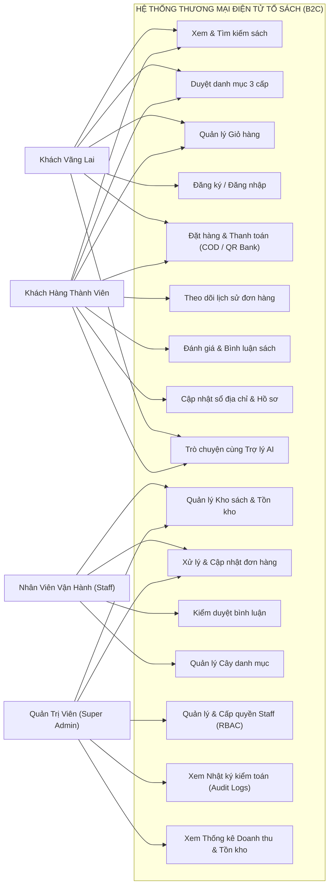

---

## 3.2 Phân Rã Use Case Theo Nhóm Người Dùng

### A. Phân hệ Mua sắm & Khách hàng
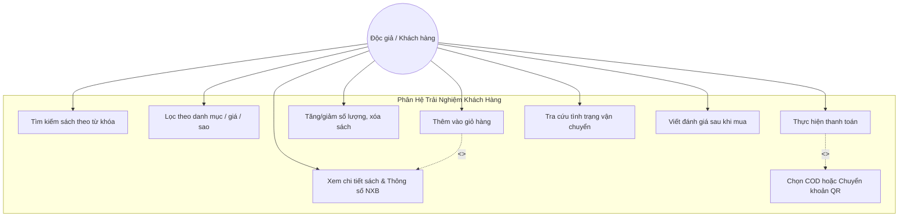

### B. Phân hệ Quản trị & Vận hành
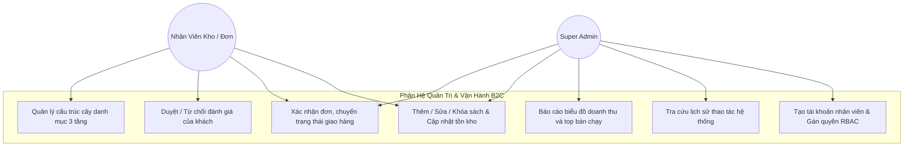

---

## 3.3 Sơ Đồ Hoạt Động Nghiệp Vụ (Activity Diagrams)

### Luồng 1: Quy trình Đặt hàng & Thanh toán (Checkout Flow)
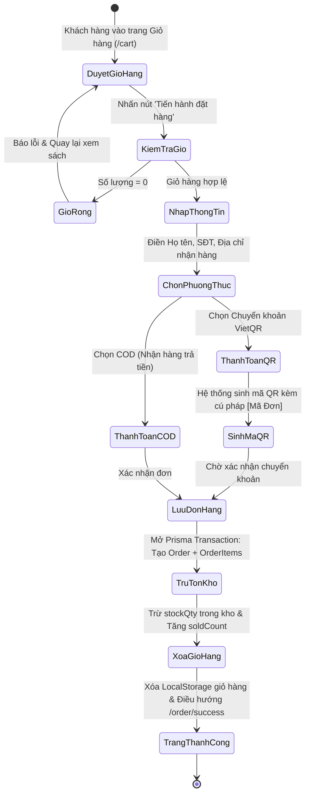

### Luồng 2: Xác thực & Phân quyền RBAC (Middleware Gateway Flow)
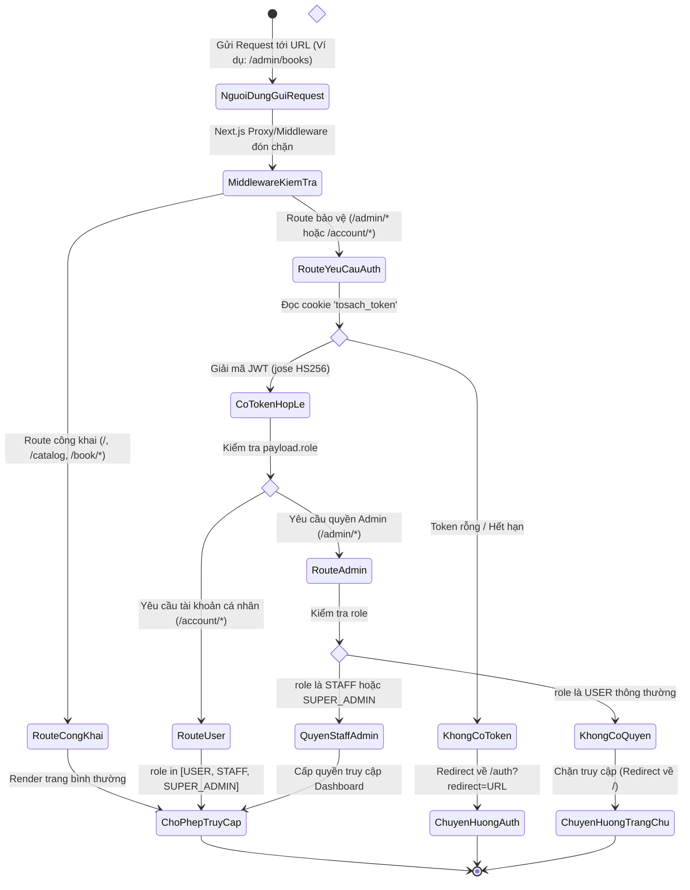

---

## 3.4 Sơ Đồ Tuần Tự Chi Tiết (Sequence Diagrams)

### Luồng 1: Đăng nhập & Tạo Cookie Bảo Mật HttpOnly JWT
```mermaid
sequenceDiagram
    autonumber
    actor User as Khách hàng / Admin
    participant UI as Form Đăng Nhập (/auth)
    participant API as Auth API (/api/auth/login)
    participant DB as PostgreSQL (Supabase)
    participant Cookie as Trình duyệt (Cookie Jar)

    User->>UI: Nhập Email & Mật khẩu
    UI->>API: POST /api/auth/login { email, password }
    API->>DB: prisma.user.findUnique({ where: { email } })
    DB-->>API: Trả về bản ghi User (kèm passwordHash, role)
    
    alt Không tìm thấy Email hoặc Bị Banned
        API-->>UI: HTTP 401: "Email hoặc mật khẩu không chính xác"
        UI-->>User: Hiển thị thông báo lỗi
    else Email hợp lệ
        API->>API: bcrypt.compare(password, passwordHash)
        alt Mật khẩu sai
            API-->>UI: HTTP 401: "Email hoặc mật khẩu không chính xác"
            UI-->>User: Hiển thị thông báo lỗi
        else Mật khẩu chính xác
            API->>API: Tạo JWT Token (HS256: userId, role, fullName)
            API->>Cookie: Set-Cookie: tosach_token=JWT; HttpOnly; SameSite=Lax; Path=/
            API-->>UI: HTTP 200 { success: true, user: { id, email, role } }
            UI-->>User: Chuyển hướng về Trang chủ hoặc Trang Admin
        end
    end
```

---

### Luồng 2: Khách hàng Đặt hàng & Transaction Cơ Sở Dữ Liệu
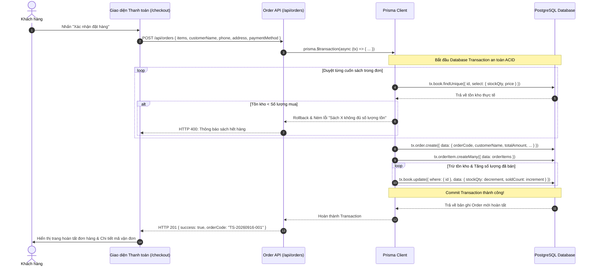

---

### Luồng 3: Trợ Lý AI Tư Vấn Sách (Gemini Flash RAG Flow)
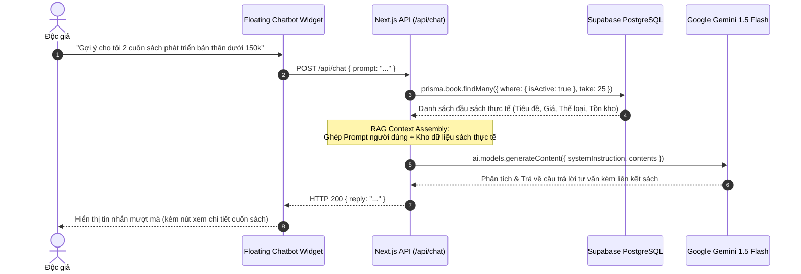

---

## 3.5 Sơ Đồ Chuyển Trạng Thái (State Machine Diagrams)

### A. Vòng đời Trạng thái Đơn hàng (`OrderStatus`)
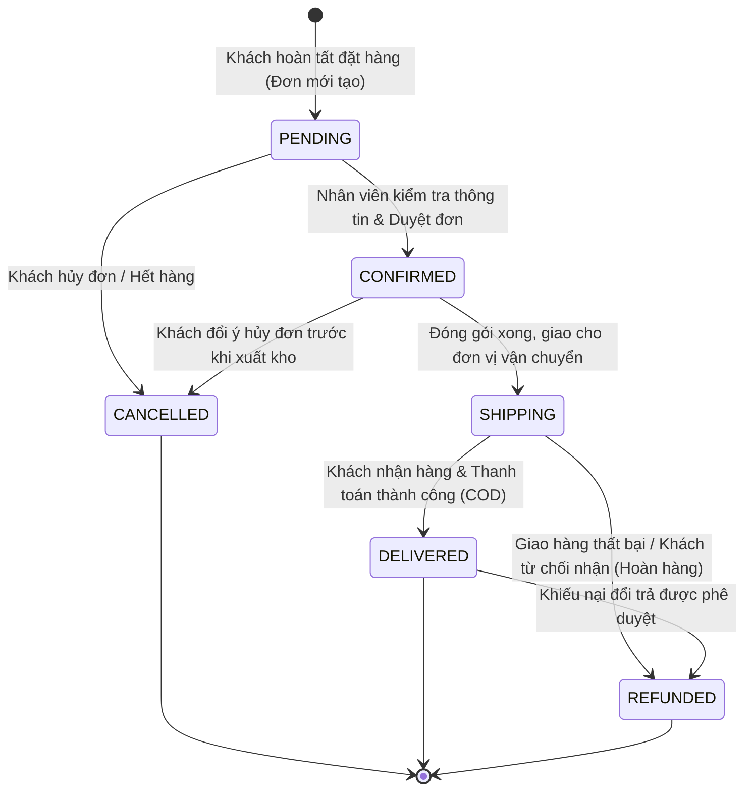

### B. Vòng đời Trạng thái Đánh giá Độc giả (`ReviewStatus`)
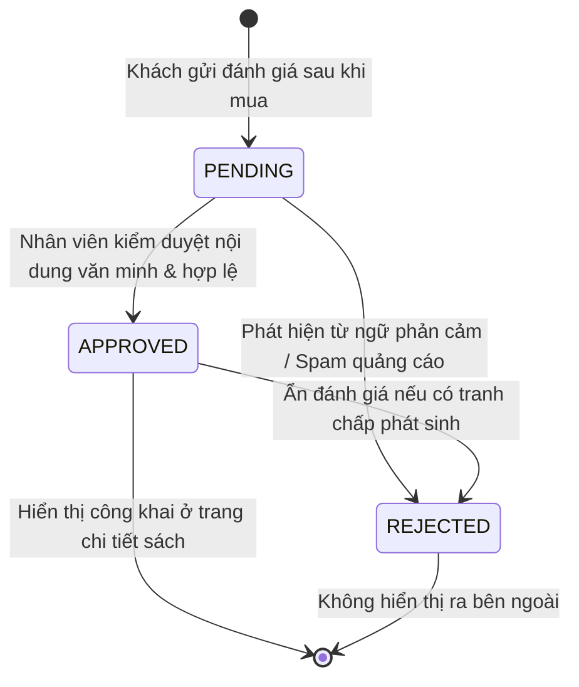

---

## 3.6 Sơ Đồ Cấu Trúc Thông Tin & Điều Hướng (Site Map)

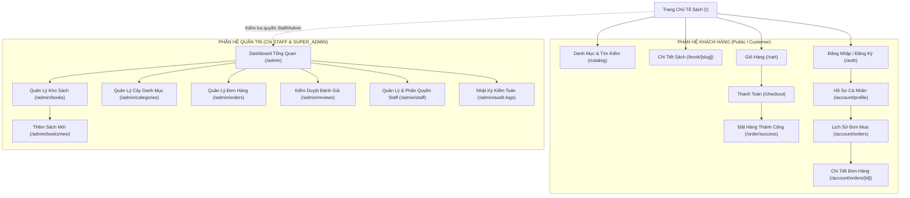

---

# 📅 PHẦN 4: Kế Hoạch Báo Cáo Tiến Độ 8 Tuần

> **Khung thời gian:** Từ **07/09/2026** đến **30/10/2026** (~8 tuần).  
> **Tần suất báo cáo:** Định kỳ **2 tuần một lần** (4 cột mốc lớn nộp cho Giảng viên hướng dẫn).

---

## 4.1 Bảng 4 Cột Mốc Báo Cáo Chính

| Đợt Báo Cáo | Thời điểm | Tên Giai Đoạn | Mục tiêu cốt lõi cần đạt | Sản phẩm bàn giao (Deliverables) |
|:---:|:---:|---|---|---|
| **ĐỢT 1** | **20/09/2026**<br/>*(Cuối Tuần 2)* | **Khởi Tạo Nền Tảng, Thiết Kế UI & Kiến Trúc Dữ Liệu** | • Chốt mô hình B2C chuẩn Proposal.<br/>• Thống nhất toàn bộ thiết kế giao diện web (Design System, Wireframes & Mockups các trang chính).<br/>• Dựng Next.js 15, Prisma ORM 14 bảng, kết nối Supabase Cloud.<br/>• Xây dựng Custom JWT Auth & RBAC Middleware.<br/>• Nạp Seed Data mẫu và dựng Shared Layout (Header/Footer). | 1. Source code nhánh `main` trên GitHub.<br/>2. Database 14 bảng hoạt động trên Supabase.<br/>3. Bản quy chuẩn thiết kế UI/UX & Design System.<br/>4. Tài liệu thiết kế hệ thống đầy đủ.<br/>5. Demo test thành công các API Auth. |
| **ĐỢT 2** | **04/10/2026**<br/>*(Cuối Tuần 4)* | **Trải Nghiệm Khách Hàng Toàn Diện (Storefront)** | • Hoàn thiện Trang chủ (Hero, Bestseller, Danh mục).<br/>• Hoàn thiện Trang Catalog bộ lọc 3 cấp & Tìm kiếm sách.<br/>• Trang Chi tiết sách & Form Đánh giá.<br/>• Hoàn thiện Giỏ hàng & Luồng Thanh toán (COD / Chuyển khoản QR) lưu đơn thật vào DB. | 1. Luồng mua hàng hoạt động từ A-Z trên web.<br/>2. Video demo quy trình đặt hàng và trừ tồn kho tự động.<br/>3. Đơn hàng hiển thị chuẩn trong bảng `orders` trên Supabase. |
| **ĐỢT 3** | **18/10/2026**<br/>*(Cuối Tuần 6)* | **Phân Hệ Quản Trị & Vận Hành (Admin & RBAC)** | • Xây dựng Dashboard thống kê doanh thu/tồn kho.<br/>• Module Quản lý kho sách (CRUD sách, upload ảnh bìa).<br/>• Module Quản lý danh mục 3 tầng & Xử lý đơn hàng.<br/>• Module Kiểm duyệt đánh giá & Phân quyền nhân viên động.<br/>• Nhật ký truy vết Audit Logs bảo mật. | 1. Toàn bộ route `/admin/*` hoạt động chuẩn với từng vai trò.<br/>2. Demo tài khoản Staff Kho không vào được trang Quản lý đơn, Staff Đơn không sửa được sách.<br/>3. Báo cáo kiểm thử bảo mật phân quyền. |
| **ĐỢT 4** | **30/10/2026**<br/>*(Nghiệm Thu)* | **Kiểm Thử Toàn Diện, Triển Khai & Hoàn Tất Đồ Án** | • Tích hợp Trợ lý AI Gemini Flash tư vấn sách.<br/>• Tối ưu Core Web Vitals, Responsive 100% Mobile/Tablet.<br/>• Triển khai Production lên Vercel Cloud (Live URL).<br/>• Hoàn tất Quyển Báo cáo Thuyết minh đồ án và Slide bảo vệ. | 1. Đường link trang web chính thức (Live Production URL).<br/>2. Quyển thuyết minh đồ án hoàn chỉnh (PDF/Word).<br/>3. Slide thuyết trình bảo vệ trước Hội đồng.<br/>4. Biên bản nghiệm thu sản phẩm phần mềm. |

---

## 4.2 Bảng Chi Tiết Công Việc Từng Tuần (Tuần 1 đến Tuần 8)

### Tuần 1: Khởi động dự án, Thiết kế UI thống nhất & Đặc tả kiến trúc (07/09 — 13/09/2026)
* **Mục tiêu:** Định vị mô hình B2C, thiết kế thống nhất toàn bộ giao diện web (Design System, Wireframes & Mockups), loại bỏ các thành phần râu ria của prototype cũ, thiết kế ERD.
* **Đầu việc cụ thể:**
  - [x] **Thiết kế Thống nhất Giao diện Web (Design System & UI Mockups):**
    + Xây dựng bộ quy chuẩn nhận diện thương hiệu số (Design Tokens): Bảng màu chủ đạo (Xanh hải quân sâu `#0B1F3A`, Vàng nghệ `#F5A623`, Nền kem ấm `#FAF7F2`, Xám đá Slate), Typography chuẩn hóa (Geist Sans / Inter), lưới layout 12 cột, hệ thống bo góc và bóng đổ (Elevation).
    + Thiết kế Wireframes & Mockup trực quan toàn bộ các màn hình cốt lõi theo phong cách B2C sang trọng, tinh tế: Trang chủ, Danh mục Catalog 3 tầng, Chi tiết sách, Giỏ hàng, Thanh toán, Theo dõi đơn hàng và Admin Dashboard.
    + Thống nhất bộ thư viện UI Components tái sử dụng: Buttons, Input fields, Dropdowns, BookCard, Badges trạng thái giao hàng, Modal thông báo, Breadcrumbs phân cấp.
  - [x] **Rà soát & Định hình Nghiệp vụ:** Rà soát Proposal đồ án liên ngành, chốt mô hình B2C (loại bỏ dứt điểm các thành phần C2C bán sách cũ, banner tuyển seller, yêu cầu tìm sách hiếm và ô voucher).
  - [x] **Lựa chọn Tech Stack:** Next.js 15 (App Router), TypeScript, Tailwind CSS v4, Prisma ORM 6, PostgreSQL Supabase.
  - [x] **Thiết kế Kiến trúc Dữ liệu ban đầu:** Thiết kế sơ bộ bản vẽ ERD 14 bảng dữ liệu và sơ đồ Use Case tổng quan.
  - [x] **Khởi tạo Quản lý Mã nguồn:** Thiết lập Git repository cục bộ và remote GitHub an toàn, cấu hình `.gitignore` chuẩn bảo mật.

### Tuần 2: Hiện thực hóa nền tảng, Database & Auth (14/09 — 20/09/2026) — *[ĐANG DIỄN RA]*
* **Mục tiêu:** Đưa Database lên Cloud, hoàn thành hệ thống Auth và dựng Shared Layout.
* **Đầu việc cụ thể:**
  - [x] Tạo dự án Next.js 15 tại thư mục gốc; lưu trữ code cũ vào [`legacy/`](file:///e:/to-sach-studio/legacy).
  - [x] Viết [`prisma/schema.prisma`](file:///e:/to-sach-studio/prisma/schema.prisma) 14 models; cấu hình Pooler và Direct URL.
  - [x] Đẩy bảng lên Supabase (`prisma db push`); viết và nạp `prisma/seed.ts` (4 users, 8 sách, 15 danh mục).
  - [x] Viết bộ xác thực Custom JWT (`src/lib/auth.ts`) và RBAC Proxy (`src/middleware.ts`).
  - [ ] Di chuyển Header và Footer B2C từ `legacy/` sang Next.js; tạo `CartContext` LocalStorage.
  - [ ] Dựng giao diện sơ bộ Trang chủ (`src/app/page.tsx`) kết nối Prisma query sách thật.
  - 🎯 **Nhiệm vụ báo cáo:** Nộp báo cáo Đợt 1 cho Giảng viên hướng dẫn (Kiến trúc, Database, UI Design System và Auth).

### Tuần 3: Danh Mục Sách & Trang Chi Tiết (21/09 — 27/09/2026)
* **Mục tiêu:** Xây dựng xong trang duyệt sách theo danh mục và trang xem chi tiết sách.
* **Đầu việc cụ thể:**
  - [ ] Xây dựng trang `/catalog`: Bộ lọc cây danh mục 3 tầng (L1 - L2 - L3), lọc khoảng giá, lọc sao đánh giá.
  - [ ] Tích hợp tính năng sắp xếp: Giá tăng dần, Giá giảm dần, Mới nhất, Bán chạy nhất.
  - [ ] Xây dựng trang `/book/[slug]`: Render thông tin sách, thư viện ảnh bìa, thông số xuất bản (NXB, số trang, kích thước, định dạng).
  - [ ] Hiển thị danh sách đánh giá đã duyệt từ bảng `reviews` và tính toán sao trung bình.
  - [ ] Xử lý nút "Thêm vào giỏ hàng" và "Mua ngay".

### Tuần 4: Giỏ Hàng & Quy Trình Thanh Toán Hoàn Chỉnh (28/09 — 04/10/2026)
* **Mục tiêu:** Khách hàng có thể đặt hàng thành công và hệ thống lưu đơn vào Database thật.
* **Đầu việc cụ thể:**
  - [ ] Xây dựng trang Giỏ hàng `/cart`: Tăng/giảm số lượng, kiểm tra giới hạn tồn kho, xóa sản phẩm, tính tổng tiền.
  - [ ] Xây dựng trang Thanh toán `/checkout`: Form nhập thông tin người nhận (Họ tên, SĐT, Tỉnh/Huyện/Xã/Địa chỉ chi tiết).
  - [ ] Xử lý 2 phương thức thanh toán: COD và Chuyển khoản QR ngân hàng (tự động điền mã đơn).
  - [ ] Viết API `/api/orders` dùng Prisma Transaction: tạo `orders`, tạo `order_items`, tự động trừ `stockQty` và tăng `soldCount`.
  - [ ] Xây dựng trang `/account/orders` hiển thị lịch sử đơn mua của người dùng kèm timeline trạng thái.
  - 🎯 **Nhiệm vụ báo cáo:** Nộp báo cáo Đợt 2 cho Giảng viên hướng dẫn (Toàn bộ luồng Khách hàng hoàn tất).

### Tuần 5: Phân Hệ Admin — Kho Sách & Danh Mục (05/10 — 11/10/2026)
* **Mục tiêu:** Xây dựng các chức năng quản lý danh mục và kho sách cho nhân viên kho.
* **Đầu việc cụ thể:**
  - [ ] Xây dựng layout trang Admin (`src/app/admin/layout.tsx`) với thanh điều hướng phân quyền.
  - [ ] Xây dựng Dashboard (`/admin`): Thẻ thống kê nhanh (Tổng doanh thu, Tổng đơn hàng, Tổng đầu sách, Đơn chờ xử lý).
  - [ ] Xây dựng Quản lý Kho sách (`/admin/books`): Bảng danh sách sách, tìm kiếm, lọc trạng thái kho (Còn hàng / Sắp hết / Hết hàng).
  - [ ] Xây dựng Form Thêm / Sửa sách (`/admin/books/new`, `/admin/books/[id]`): Nhập giá, tải ảnh bìa, chọn tác giả, chọn danh mục.
  - [ ] Xây dựng Quản lý Danh mục (`/admin/categories`): Thêm / sửa / xóa các cấp danh mục trong cây phân cấp.

### Tuần 6: Phân Hệ Admin — Đơn Hàng, Đánh Giá & Phân Quyền RBAC (12/10 — 18/10/2026)
* **Mục tiêu:** Hoàn thiện toàn bộ các chức năng quản trị còn lại của hệ thống.
* **Đầu việc cụ thể:**
  - [ ] Xây dựng Quản lý Đơn hàng (`/admin/orders`): Lọc theo trạng thái đơn (`PENDING`, `CONFIRMED`, `SHIPPING`, `DELIVERED`, `CANCELLED`).
  - [ ] Xây dựng chức năng cập nhật trạng thái đơn và mã vận đơn tracking code.
  - [ ] Xây dựng Kiểm duyệt Đánh giá (`/admin/reviews`): Duyệt (`APPROVED`) hoặc Từ chối (`REJECTED`) bình luận độc giả.
  - [ ] Xây dựng Phân quyền Nhân viên (`/admin/staff`): Chỉ `SUPER_ADMIN` mới được tạo tài khoản Staff và tích chọn cấp quyền.
  - [ ] Xây dựng Trang xem Nhật ký kiểm toán (`/admin/audit-logs`): Xem lại các thao tác nhạy cảm.
  - 🎯 **Nhiệm vụ báo cáo:** Nộp báo cáo Đợt 3 cho Giảng viên hướng dẫn (Phân hệ Admin & RBAC hoàn tất).

### Tuần 7: Tích Hợp Nâng Cao, Bảo Mật & Tối Ưu Hệ Thống (19/10 — 25/10/2026)
* **Mục tiêu:** Nâng cao chất lượng kỹ thuật, thêm tính năng AI và tối ưu hiệu năng.
* **Đầu việc cụ thể:**
  - [ ] Tích hợp Floating AI Chatbot (Gemini 1.5 Flash) qua API `/api/chat` đóng vai trò trợ lý tư vấn sách Tổ Sách.
  - [ ] Tối ưu hóa SEO: Thêm thẻ OpenGraph, Meta description, Schema markup `Product` và `BreadcrumbList` cho từng đầu sách.
  - [ ] Kiểm tra và gia cố bảo mật: Rate limiting chống spam API, validate dữ liệu đầu vào bằng `zod`.
  - [ ] Kiểm thử tự động: Viết kịch bản kiểm thử API (Auth, Order Creation) và kiểm tra tương thích trên màn hình điện thoại (Responsive Mobile).

### Tuần 8: Đóng Gói Triển Khai, Viết Báo Cáo & Chuẩn Bị Bảo Vệ (26/10 — 30/10/2026)
* **Mục tiêu:** Đưa hệ thống lên Production thực tế, hoàn tất hồ sơ nghiệm thu và slide bảo vệ.
* **Đầu việc cụ thể:**
  - [ ] Triển khai ứng dụng chính thức lên Vercel Cloud kết nối Supabase Cloud Production.
  - [ ] Kiểm tra toàn diện lần cuối trên đường link thật (UAT - User Acceptance Testing).
  - [ ] Soạn thảo và hoàn thiện Quyển Thuyết minh Báo cáo Đồ án (chèn toàn bộ sơ đồ ở Phần 1, 2, 3 vào báo cáo).
  - [ ] Thiết kế Slide thuyết trình bảo vệ đồ án (khoảng 20 - 25 slides tinh gọn, trực quan, làm nổi bật kiến trúc kỹ thuật).
  - [ ] Chuẩn bị kịch bản demo trực tiếp trước Hội đồng chấm thi.
  - 🎯 **Nhiệm vụ báo cáo:** Nghiệm thu toàn diện đề tài ngày 30/10/2026.

---

# 🖨️ PHẦN 5: Hướng Dẫn Trích Xuất Sơ Đồ

Để đưa các sơ đồ trong tài liệu này vào file báo cáo Word (`.docx`), PowerPoint hoặc LaTeX mà không bị vỡ nét hay nhòe chữ:

1. **Cách 1: Mermaid Live Editor (Khuyên dùng - Ảnh sắc nét nhất)**
   - Truy cập [mermaid.live](https://mermaid.live).
   - Sao chép toàn bộ nội dung trong khối mã ````mermaid ... ```` của sơ đồ cần dùng.
   - Dán vào khung Code bên trái.
   - Nhấn **Actions** $\rightarrow$ **Download PNG** (hoặc **Download SVG** - dạng vector vô cực) để chèn vào Word.
2. **Cách 2: Chụp trực tiếp từ Markdown Preview Enhanced trên IDE**
   - Bấm chuột phải vào sơ đồ được hiển thị trong Artifact $\rightarrow$ Chọn **Copy Image** hoặc **Save Image**.
